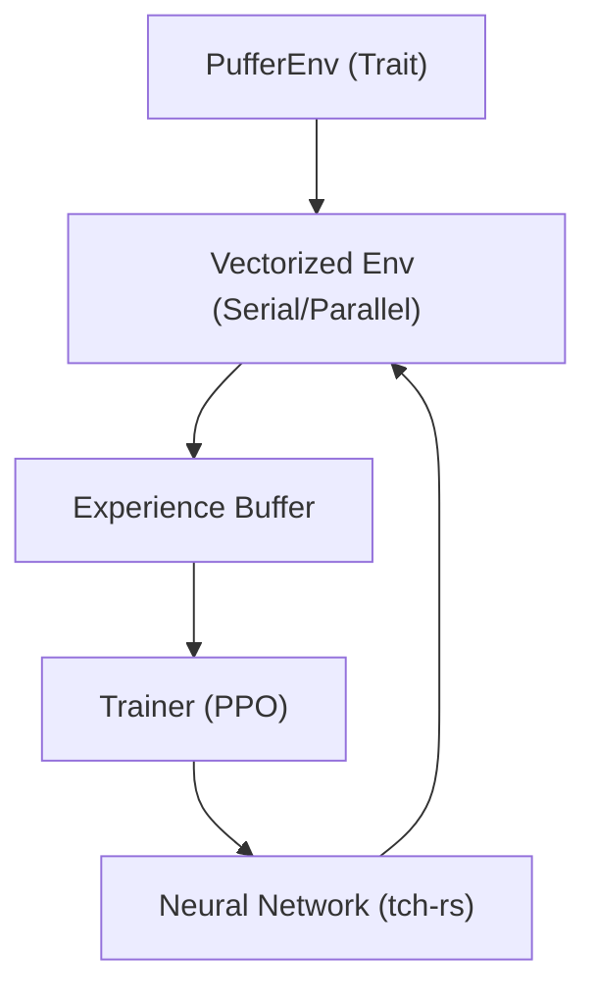

# 🏗️ Architecture: PufferLib Rust

This document provides a deep dive into the internal design and implementation of PufferLib Rust.

## 📐 System Overview

PufferLib Rust is designed to be a high-performance, modular framework for reinforcement learning. It follows a "Trait-first" philosophy, allowing developers to swap out environments, vectorization strategies, and training algorithms with minimal friction.

### Core Components

## 🧩 Key Modules

### 1. `pufferlib::spaces`
Implements the core observation and action spaces. Supports complexity through recursion (e.g., `Dict` spaces containing `Box` and `Discrete` spaces).
- **Optimization**: Uses `ndarray` for efficient multi-dimensional array manipulation.

### 2. `pufferlib::vector`
Handles the execution of multiple environment instances.
- **Serial**: Runs environments in a single thread, ideal for debugging.
- **Parallel**: Leverages `Rayon` for work-stealing parallelism, maximizing CPU utilization during rollout collection.

### 3. `pufferlib::policy`
Bindings to `libtorch` via the `tch` crate.
- **MLP**: standard multi-layer perceptron for simple state-based environments.
- **LSTM**: Recurrent architecture for POMDPs (Partially Observable Markov Decision Processes).

### 4. `pufferlib::training`
The PPO implementation.
- **V-trace**: Implements V-trace for off-policy corrections, keeping training stable even with asynchronous updates.
- **GAE**: Generalized Advantage Estimation for variance reduction.

## ⚡ Performance Considerations

PufferLib Rust achieves superior performance by:
1. **Zero-copy Transfers**: Observations are moved into buffers with minimal copying.
2. **Native Math**: Utilizing BLAS/LAPACK backends through LibTorch and ndarray for high-speed tensor operations.
3. **No GIL**: Unlike Python RL libraries, PufferLib Rust is free from Global Interpreter Lock issues, allowing true multi-threaded environment stepping.

## 🛠️ Data Flow

1. **Reset**: All environments are initialized with seeds.
2. **Rollout**: The `Trainer` coordinates with the `VectorizedEnv` to collect $N$ steps of experience.
3. **Compute**: Advantages and Returns are calculated in the `ExperienceBuffer`.
4. **Update**: The `Policy` network is updated using mini-batch SGD over multiple epochs.
5. **Evaluate**: Statistics are logged, and the loop continues.
