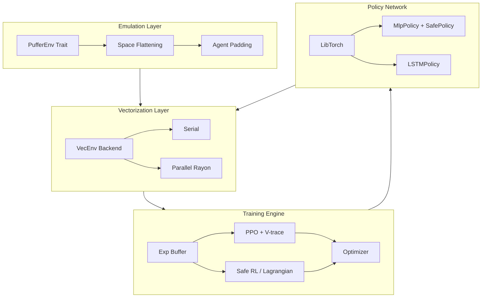

# 🏗️ Architecture: PufferLib Rust

This document provides a deep dive into the internal design and implementation of PufferLib Rust.

## 📐 System Overview

PufferLib Rust is designed to be a high-performance, modular framework for reinforcement learning. It follows a "Trait-first" philosophy, allowing developers to swap out environments, vectorization strategies, and training algorithms with minimal friction.

### System Components

## 🧩 Key Modules

### 1. `pufferlib::spaces`
Implements the core observation and action spaces. Supports complexity through recursion (e.g., `Dict` spaces containing `Box` and `Discrete` spaces).
- **Optimization**: Uses `ndarray` for efficient multi-dimensional array manipulation.

### 2. `pufferlib::vector`
Handles the execution of multiple environment instances.
- **Serial**: Runs environments in a single thread, ideal for debugging.
- **Parallel**: Leverages `Rayon` for work-stealing parallelism, maximizing CPU utilization during rollout collection.

### 3. `pufferlib::policy`
Bindings to `libtorch` via the `tch` crate.
- **MLP**: standard multi-layer perceptron for simple state-based environments.
- **LSTM**: Recurrent architecture for POMDPs (Partially Observable Markov Decision Processes).

### 4. `pufferlib::training`
The PPO implementation.
- **V-trace**: Implements V-trace for off-policy corrections, keeping training stable even with asynchronous updates.
- **GAE**: Generalized Advantage Estimation for variance reduction.

### 5. `pufferlib::training::safe_ppo`
The implementation of Constrained PPO.
- **Lagrangian Multiplier**: Dynamically balances the reward objective with safety constraints.
- **Dual Critics**: Maintains separate value estimates for rewards and safety costs.
- **Cost GAE**: Extends advantage estimation to cost signals for stable safety-constrained learning.

### 6. `pufferlib::grpo`
Preference-based optimization.
- **Group Clipping**: Implements group-relative normalization for stable preference alignment.

### 7. `pufferlib::mappo`
Multi-agent training foundation.
- **Centralized Critic**: Supports training with global state information while maintaining decentralized actor execution.

### 8. `pufferlib::dreamer`
World model implementation.
- **RSSM**: Recurrent State-Space Model for latent dynamics prediction.
- **Imagination**: Enables training on synthetic trajectories generated by the learned model.

### 9. `pufferlib::offline`
Sequence modeling and Decision Transformer (DT).
- **Trajectory Modeling**: Treats RL as a conditional sequence prediction task.

### 10. `pufferlib::checkpoint`
Robust state persistence.
- **State Manager**: Handles versioned serialization of policies, optimizers, and trainer states.

## 🛡️ The Emulation Layer
The core innovation of PufferLib is the **Emulation Layer**. It acts as a bidirectional translator between:
1. **Dynamic Simulations**: Environments with variable numbers of agents, heterogeneous action spaces, and nested observations.
2. **Static Neural Networks**: Policies that require fixed-size tensor inputs and constant action dimensions.

Rust achieves this through `DynSpace` and recursive flattening, ensuring that any complex simulation can be trained by a standard MLP or LSTM without modifying the agent code.

## 🔌 Hardware Backends
PufferLib Rust is backend-agnostic, supporting multiple tensor engines:
- **LibTorch** (`tch-rs`): High-performance C++ backend.
- **Burn**: Pure-Rust ML framework for highly portable, backend-agnostic models.
- **Candle**: HuggingFace's pure-Rust ML framework for zero-dependency distributed deployment.
- **Luminal**: Graph-compiling engine for hardware-specific optimizations (In Progress).

## ⚡ Performance & Portability Considerations

PufferLib Rust achieves superior performance and reach by:
1. **no_std Core**: The core traits (`PufferEnv`, `DynSpace`) are `no_std` compatible, enabling RL inference on embedded devices and in WASM.
2. **Zero-copy Transfers**: Observations are moved into buffers with minimal copying.
3. **Native Math**: Utilizing BLAS/LAPACK backends through LibTorch and ndarray for high-speed tensor operations.
4. **No GIL**: Unlike Python RL libraries, PufferLib Rust is free from Global Interpreter Lock issues, allowing true multi-threaded environment stepping.

## 📦 Ecosystem Integrations
- **HuggingFace Hub**: Direct model upload/download support via `push_to_hub`.
- **Weights & Biases**: Native experiment tracking.
- **TensorBoard**: Scalar and histogram logging.

## 🛠️ Data Flow

1. **Reset**: All environments are initialized with seeds.
2. **Rollout**: The `Trainer` coordinates with the `VectorizedEnv` to collect $N$ steps of experience.
3. **Compute**: Advantages and Returns are calculated in the `ExperienceBuffer`. For Safe RL, cost-advantages and cost-returns are also computed.
4. **Update**: The `Policy` network is updated using mini-batch SGD. In `SafeTrainer`, the objective includes the Lagrangian term.
5. **Evaluate**: Statistics (including mean costs and lambda) are logged, and the loop continues.
