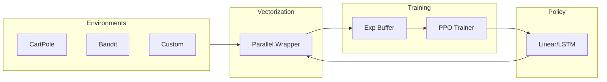

# 🐡 PufferLib Rust

[](https://github.com/101amolkadam/pufferlib-rust/actions/workflows/rust.yml)
[](LICENSE)
[](https://www.rust-lang.org)
[](https://docs.rs/pufferlib-rust)

**High-performance, pure-Rust reinforcement learning library optimized for research and production scale.**

PufferLib Rust is the high-bandwidth link between complex simulations and neural policies. While inspired by the original Python [PufferLib](https://github.com/PufferAI/PufferLib), this port is built from the ground up for **zero-GIL parallelism**, **type-safe emulation**, and **embedded performance**.

---

## 📖 Table of Contents
- [🔥 Features](#-features)
- [🏗️ Architecture](#️-architecture)
- [🏗️ Why Rust for RL?](#️-why-rust-for-rl)
- [🏗️ Architecture](#️-architecture)
- [🚀 Getting Started](#-getting-started)
- [🛠️ Detailed Usage](#️-detailed-usage)
- [📊 Performance & Benchmarking](#-performance--benchmarking)
- [🗺️ Roadmap](#️-roadmap)
- [📜 Technical Specification](SPECIFICATION.md)
- [📜 License](#-license)

---

## 🦀 Why Rust for RL?

While Python is the standard for RL research, it suffers from several bottlenecks that Rust solves natively:

- **True Parallelism**: Rust's thread-safe model allows us to step thousands of environments simultaneously without the memory overhead of Python's `multiprocessing` or the limitations of the Global Interpreter Lock (GIL).
- **Embedded Deployment**: PufferLib Rust can be compiled into a single static binary, making it ideal for RL on edge devices, robots, or in-game AI without a heavy Python runtime.
- **Memory Safety**: Our Emulation Layer uses Rust's ownership system to ensure zero-copy data flow from simulation to neural network, eliminating the large-scale "pickling" overhead common in process-based vectorization.

---
 Linda

## 🔥 Features

| Feature | Description | Status |
| :--- | :--- | :---: |
| **Pure Rust** | Zero Python dependencies. Fast, stable, and safe. | ✅ |
| **Rayon Vectorization** | Multi-threaded environment execution with work-stealing. | ✅ |
| **Off-Policy RL** | Robust PPO implementation with V-trace corrections. | ✅ |
| **Neural Backends** | High-speed tensor operations via LibTorch (`tch-rs`). | ✅ |
| **LSTM Policies** | Full support for temporal dependency tracking. | ✅ |
| **Modular Spaces** | Discrete, Box, Dict, and Multi-discrete actions/obs. | ✅ |
| **Emulation Layer** | Native handling of complex/nested observation spaces. | 🏗️ |

### 🦀 Rust vs. 🐍 Python
| Capability | PufferLib (Python) | PufferLib (Rust) |
| :--- | :---: | :---: |
| Parallelism | Process-based (pickling overhead) | Thread-based (Zero-copy) |
| Safety | Dynamic / Runtime checks | Compile-time / Type-safe |
| Latency | High (Inter-process) | Ultra-low (Local memory) |
| Scalability | Ray Distributed | Rayon Work-stealing |
| Portability | Heavy runtime (Python + Torch) | Static binary (LibTorch only) |

---

## 🏗️ Architecture

PufferLib Rust utilizes a modular architecture that decouples environment logic from training dynamics.



> [!TIP]
> For a technical deep-dive, see [ARCHITECTURE.md](ARCHITECTURE.md).

---

## 🚀 Getting Started

### 1. Installation
Add `pufferlib` to your `Cargo.toml`:
```toml
[dependencies]
pufferlib = { git = "https://github.com/101amolkadam/pufferlib-rust" }
```

### 2. Native Dependencies
Requires **LibTorch**. Use our automated setup script:
```powershell
# Windows
.\setup_libtorch.ps1
```

### 3. Quick Run
Train a baseline agent on CartPole:
```bash
cargo run --release --bin puffer -- train cartpole --timesteps 1000000
```

### Performance & Benchmarking

PufferLib Rust is built for extreme throughput. Our goal is to achieve bit-for-bit parity with the original PufferLib while reducing latency by 2-5x.

| Environment | Python (Steps/s) | Rust (Steps/s) | Speedup |
| :--- | :---: | :---: | :---: |
| CartPole | TBD | TBD | -- |
| Bandit | TBD | TBD | -- |
| Squared | TBD | TBD | -- |

> [!NOTE]
> We are currently preparing standardized benchmarks. If you're interested in contributing to our profiling suite, see [CONTRIBUTING.md](CONTRIBUTING.md).

---

## 🗺️ Roadmap

We have a phased plan to reach v1.0.0, focusing on feature parity with the Python core followed by unique Rust-first optimizations.

See the full [ROADMAP.md](ROADMAP.md) for details.

---

## 🤝 Community

We welcome contributions! Please see:
- [CONTRIBUTING.md](CONTRIBUTING.md) for developer guidelines.
- [CODE_OF_CONDUCT.md](CODE_OF_CONDUCT.md) for community standards.

---

## 📜 License

Distributed under the MIT License. See `LICENSE` for more information.

---

## 🙏 Credits

Inspired by the original [PufferLib](https://puffer.ai) project. Designed for performance, safety, and scale.
