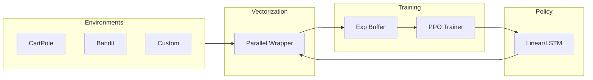

# 🐡 PufferLib Rust

[](https://github.com/101amolkadam/pufferlib-rust/actions/workflows/rust.yml)
[](LICENSE)
[](https://www.rust-lang.org)
[](https://docs.rs/pufferlib-rust)

**High-performance, pure-Rust reinforcement learning library optimized for research and production scale.**

PufferLib Rust is the evolution of reinforcement learning for the Rust ecosystem. Designed for researchers who need native performance and developers who demand type-safe production systems.

---

## 📖 Table of Contents
- [🔥 Features](#-features)
- [🏗️ Architecture](#️-architecture)
- [🚀 Getting Started](#-getting-started)
- [🛠️ Detailed Usage](#️-detailed-usage)
- [📊 Performance](#-performance)
- [🗺️ Roadmap](#️-roadmap)
- [📜 License](#-license)

---

## 🔥 Features

| Feature | Description | Status |
| :--- | :--- | :---: |
| **Pure Rust** | Zero Python dependencies. Fast, stable, and safe. | ✅ |
| **Rayon Vectorization** | Multi-threaded environment execution with work-stealing. | ✅ |
| **Off-Policy RL** | Robust PPO implementation with V-trace corrections. | ✅ |
| **Neural Backends** | High-speed tensor operations via LibTorch (`tch-rs`). | ✅ |
| **LSTM Policies** | Full support for temporal dependency tracking. | ✅ |
| **Modular Spaces** | Discrete, Box, Dict, and Multi-discrete actions/obs. | ✅ |

---

## 🏗️ Architecture

PufferLib Rust utilizes a modular architecture that decouples environment logic from training dynamics.



> [!TIP]
> For a technical deep-dive, see [ARCHITECTURE.md](ARCHITECTURE.md).

---

## 🚀 Getting Started

### 1. Installation
Add `pufferlib` to your `Cargo.toml`:
```toml
[dependencies]
pufferlib = { git = "https://github.com/101amolkadam/pufferlib-rust" }
```

### 2. Native Dependencies
Requires **LibTorch**. Use our automated setup script:
```powershell
# Windows
.\setup_libtorch.ps1
```

### 3. Quick Run
Train a baseline agent on CartPole:
```bash
cargo run --release --bin puffer -- train cartpole --timesteps 1000000
```

---

## 🛠️ Detailed Usage

### Custom Environments
Implement the `PufferEnv` trait to bring your own simulations to life:
```rust
impl PufferEnv for MySimulator {
    fn observation_space(&self) -> DynSpace { ... }
    fn step(&mut self, action: &ArrayD<f32>) -> StepResult { ... }
    // Full implementation in crates/pufferlib-envs
}
```

### Off-Policy Correction (V-trace)
PufferLib uses V-trace to handle the discrepancy between the behavior policy and the target policy, essential for high-throughput vectorized training.

---

## 🗺️ Roadmap

- [ ] **v0.2.0**: Support for Multi-Agent Reinforcement Learning (MARL).
- [ ] **v0.3.0**: Add SAC (Soft Actor-Critic) implementation.
- [ ] **v0.4.0**: Integration with Bevy for 3D RL environments.
- [ ] **v1.0.0**: Stable API and full crates.io release.

---

## 🤝 Community

We welcome contributions! Please see:
- [CONTRIBUTING.md](CONTRIBUTING.md) for developer guidelines.
- [CODE_OF_CONDUCT.md](CODE_OF_CONDUCT.md) for community standards.

---

## 📜 License

Distributed under the MIT License. See `LICENSE` for more information.

---

## 🙏 Credits

Inspired by the original [PufferLib](https://puffer.ai) project. Designed for performance, safety, and scale.
