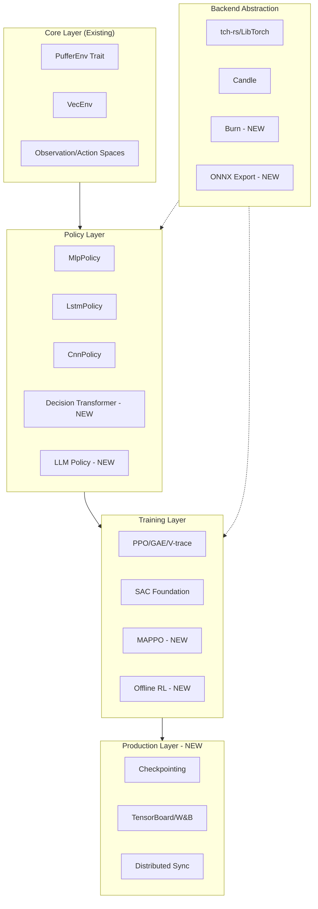
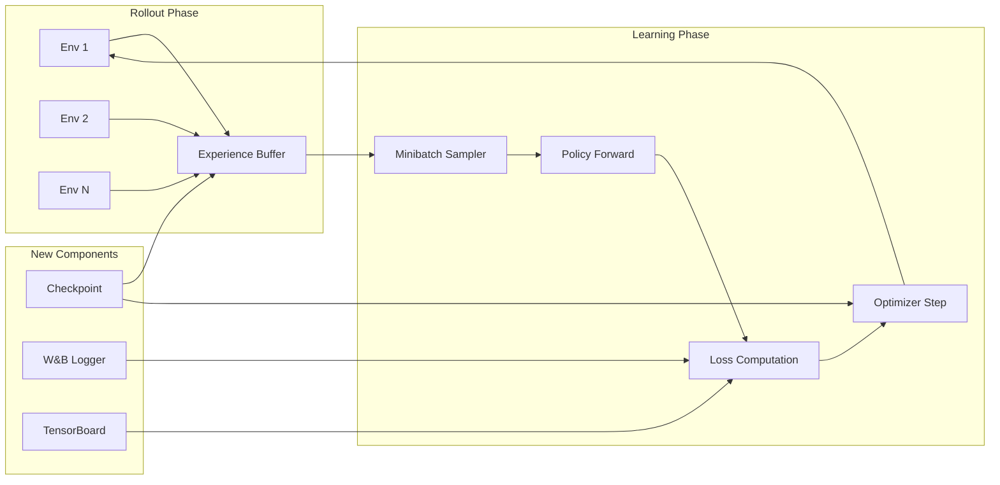

# PufferLib v2 Architecture

*Technical architecture for Roadmap 2.0 implementation.*

---

## Overview

This document provides the high-level architectural design for PufferLib v2, guiding developers on how new features integrate with the existing codebase.



---

## Module Structure

```
crates/pufferlib/src/
├── env/           # Environment traits (stable)
├── spaces/        # Observation/action spaces (stable)
├── vector/        # VecEnv implementations (stable)
├── policy/        # Neural network policies
│   ├── mlp.rs     # MLP (existing)
│   ├── lstm.rs    # LSTM (existing)
│   ├── cnn.rs     # CNN (existing)
│   ├── dt.rs      # Decision Transformer (Phase 5)
│   └── llm.rs     # LLM wrapper (Phase 8)
├── training/      # Training algorithms
│   ├── ppo.rs     # PPO utilities (existing)
│   ├── trainer.rs # Main trainer (existing)
│   ├── mappo.rs   # Multi-agent PPO (Phase 5)
│   ├── offline.rs # Offline RL (Phase 5)
│   └── world.rs   # World models (Phase 5)
├── checkpoint/    # Checkpointing system (Phase 6)
│   ├── state.rs   # TrainerState serialization
│   └── resume.rs  # Resume-from-checkpoint
├── logging/       # Observability (Phase 6)
│   ├── tensorboard.rs
│   └── wandb.rs
└── backend/       # Backend abstraction (Phase 7)
    ├── torch.rs   # LibTorch backend
    ├── candle.rs  # Candle backend
    ├── burn.rs    # Burn backend
    └── onnx.rs    # ONNX export
```

---

## Backend Abstraction Layer

### Current State
Currently, policies are tightly coupled to `tch-rs` or `candle` via feature flags:

```rust
#[cfg(feature = "torch")]
pub use mlp::MlpPolicy;
#[cfg(feature = "candle")]
pub use mlp::CandleMlp;
```

### Target State (Phase 7)
Introduce a `Backend` trait abstracting tensor operations:

```rust
pub trait Backend: Send + Sync {
    type Tensor: Clone + Send;
    type Device;
    
    fn zeros(shape: &[i64], device: &Self::Device) -> Self::Tensor;
    fn forward(&self, input: &Self::Tensor) -> Self::Tensor;
    fn backward(&self, loss: &Self::Tensor);
    fn export_onnx(&self, path: &Path) -> Result<()>;
}
```

**Benefits:**
- Single policy implementation works across backends
- Easy to add new backends (Burn, Luminal)
- ONNX export becomes first-class

---

## Training Pipeline Architecture



---

## Key Design Decisions

### 1. Trait-Based Polymorphism
All major components are defined as traits for extensibility:

| Component | Trait | Purpose |
|:----------|:------|:--------|
| Environment | `PufferEnv` | Standard env interface |
| Policy | `Policy` | Action selection |
| Trainer | `TrainerConfig` | Hyperparameter config |
| Checkpoint | `Checkpointable` | State serialization |
| Logger | `MetricLogger` | Observability |

### 2. Feature Flags for Optional Dependencies
Heavy dependencies remain behind feature flags:

| Feature | Dependencies | Purpose |
|:--------|:-------------|:--------|
| `torch` | `tch` | LibTorch backend |
| `candle` | `candle-core` | Candle backend |
| `burn` | `burn` | Burn backend (NEW) |
| `tensorboard` | `tensorboard-rs` | TensorBoard logging |
| `wandb` | `wandb` | W&B logging |

### 3. Zero-Copy Where Possible
- GPU tensors flow directly to trainer without CPU copies
- `ObservationBatch` enum allows heterogeneous tensor origins
- Shared memory for multi-process vectorization

---

## Integration Points

### Adding a New Algorithm (e.g., MAPPO)

1. **Create module**: `crates/pufferlib/src/training/mappo.rs`
2. **Define config**: Extend `TrainerConfig` or create `MappoConfig`
3. **Implement loss**: Add `mappo_policy_loss()` in `ppo.rs` or new module
4. **Integrate**: Hook into `Trainer::update()` loop
5. **Test**: Add `tests/mappo_test.rs`

### Adding a New Backend (e.g., Burn)

1. **Create module**: `crates/pufferlib/src/backend/burn.rs`
2. **Implement trait**: `impl Backend for BurnBackend`
3. **Adapt policies**: Create `BurnMlp` implementing `Policy<BurnBackend>`
4. **Feature gate**: Add `burn` feature to `Cargo.toml`
5. **Test**: Ensure feature parity with existing backends

---

## Testing Strategy

| Layer | Test Type | Location |
|:------|:----------|:---------|
| Core | Unit tests | `src/*/tests.rs` |
| Algorithms | Integration tests | `tests/` |
| End-to-end | Training loops | `examples/` |
| Performance | Benchmarks | `benches/` |

**Coverage Target**: 85%

---

## Documentation Standards

All new modules must include:
1. **Module docstring**: Purpose, usage example
2. **Function docs**: Arguments, returns, panic conditions
3. **Example code**: Runnable `#[doc]` examples
4. **Architecture Decision Records (ADRs)**: For major decisions

---

## Next Steps

| Priority | Document | Purpose |
|:--------:|:---------|:--------|
| 1 | [DECISION_TRANSFORMER.md](algorithms/DECISION_TRANSFORMER.md) | DT implementation guide |
| 2 | [MAPPO.md](algorithms/MAPPO.md) | Multi-agent training |
| 3 | [CHECKPOINTING.md](production/CHECKPOINTING.md) | State persistence |
| 4 | [LOGGING.md](production/LOGGING.md) | Observability setup |

---

*Last updated: 2026-01-28*
