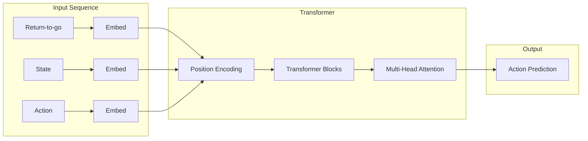

# Decision Transformer Implementation Guide

*Technical specification for implementing Decision Transformer in PufferLib.*

---

## Overview

The Decision Transformer (DT) reframes reinforcement learning as a sequence modeling problem. Instead of learning a value function or policy gradient, DT uses a transformer architecture to predict actions conditioned on desired returns.

**Paper**: [Decision Transformer: Reinforcement Learning via Sequence Modeling](https://arxiv.org/abs/2106.01345)

---

## Architecture



### Sequence Structure

Each timestep `t` consists of three tokens:
1. **Return-to-go**: `R_t = Σ_{t'=t}^T r_{t'}` (sum of future rewards)
2. **State**: `s_t` (observation)
3. **Action**: `a_t` (taken action)

The transformer sees: `(R_1, s_1, a_1, R_2, s_2, a_2, ..., R_t, s_t)`

At inference, predict `a_t` given the conditioning context.

---

## Module Design

### File: `crates/pufferlib/src/policy/dt.rs`

```rust
//! Decision Transformer policy.
//!
//! Implements offline RL via sequence modeling.

use tch::{nn, Tensor, Kind, Device};
use crate::policy::{Policy, Distribution};

/// Configuration for Decision Transformer
#[derive(Clone, Debug)]
pub struct DTConfig {
    /// State dimension (flattened observation)
    pub state_dim: i64,
    /// Action dimension
    pub action_dim: i64,
    /// Hidden dimension for embeddings
    pub hidden_dim: i64,
    /// Number of transformer layers
    pub n_layers: i64,
    /// Number of attention heads
    pub n_heads: i64,
    /// Maximum episode length
    pub max_ep_len: i64,
    /// Context length (number of timesteps in attention)
    pub context_length: i64,
    /// Dropout rate
    pub dropout: f64,
    /// Whether actions are discrete
    pub discrete_actions: bool,
}

impl Default for DTConfig {
    fn default() -> Self {
        Self {
            state_dim: 4,
            action_dim: 2,
            hidden_dim: 128,
            n_layers: 3,
            n_heads: 4,
            max_ep_len: 1000,
            context_length: 20,
            dropout: 0.1,
            discrete_actions: true,
        }
    }
}

/// Decision Transformer policy
pub struct DecisionTransformer {
    config: DTConfig,
    
    // Embedding layers
    embed_state: nn::Linear,
    embed_action: nn::Linear,
    embed_return: nn::Linear,
    embed_timestep: nn::Embedding,
    
    // Transformer blocks
    transformer: nn::TransformerEncoder,
    
    // Output projection
    predict_action: nn::Linear,
    
    // Layer norm
    embed_ln: nn::LayerNorm,
    
    // Dropout
    drop: f64,
}

impl DecisionTransformer {
    pub fn new(vs: &nn::Path, config: DTConfig) -> Self {
        let hidden = config.hidden_dim;
        
        // Embedding layers
        let embed_state = nn::linear(vs / "embed_state", config.state_dim, hidden, Default::default());
        let embed_action = nn::linear(vs / "embed_action", config.action_dim, hidden, Default::default());
        let embed_return = nn::linear(vs / "embed_return", 1, hidden, Default::default());
        let embed_timestep = nn::embedding(vs / "embed_timestep", config.max_ep_len, hidden, Default::default());
        
        // Transformer
        let encoder_layer = nn::TransformerEncoderLayer::new(
            vs / "transformer_layer",
            hidden,
            config.n_heads,
            hidden * 4,  // feedforward dim
            config.dropout,
        );
        let transformer = nn::TransformerEncoder::new(vs / "transformer", encoder_layer, config.n_layers);
        
        // Output
        let predict_action = nn::linear(vs / "predict_action", hidden, config.action_dim, Default::default());
        
        // Normalization
        let embed_ln = nn::layer_norm(vs / "embed_ln", vec![hidden], Default::default());
        
        Self {
            config,
            embed_state,
            embed_action,
            embed_return,
            embed_timestep,
            transformer,
            predict_action,
            embed_ln,
            drop: config.dropout,
        }
    }
    
    /// Forward pass for training
    ///
    /// # Arguments
    /// * `states` - [batch, seq_len, state_dim]
    /// * `actions` - [batch, seq_len, action_dim]  
    /// * `returns_to_go` - [batch, seq_len, 1]
    /// * `timesteps` - [batch, seq_len]
    /// * `attention_mask` - [batch, seq_len] optional padding mask
    pub fn forward_sequence(
        &self,
        states: &Tensor,
        actions: &Tensor,
        returns_to_go: &Tensor,
        timesteps: &Tensor,
        attention_mask: Option<&Tensor>,
    ) -> Tensor {
        let batch_size = states.size()[0];
        let seq_len = states.size()[1];
        
        // Embed each modality
        let state_embed = states.apply(&self.embed_state);
        let action_embed = actions.apply(&self.embed_action);
        let return_embed = returns_to_go.apply(&self.embed_return);
        let time_embed = timesteps.apply(&self.embed_timestep);
        
        // Add timestep embeddings
        let state_embed = &state_embed + &time_embed;
        let action_embed = &action_embed + &time_embed;
        let return_embed = &return_embed + &time_embed;
        
        // Interleave: (R_1, s_1, a_1, R_2, s_2, a_2, ...)
        // Shape: [batch, seq_len * 3, hidden]
        let stacked = Tensor::stack(
            &[return_embed, state_embed, action_embed],
            2,  // stack along new dim
        ).reshape(&[batch_size, seq_len * 3, self.config.hidden_dim]);
        
        // Layer norm
        let stacked = stacked.apply(&self.embed_ln);
        
        // Transformer forward
        // Note: PyTorch transformer expects [seq, batch, hidden]
        let stacked = stacked.transpose(0, 1);
        let transformer_out = self.transformer.forward(&stacked, None, None);
        let transformer_out = transformer_out.transpose(0, 1);
        
        // Get state position outputs (indices 1, 4, 7, ...)
        // These predict actions
        let state_indices: Vec<i64> = (0..seq_len).map(|i| i * 3 + 1).collect();
        let state_outputs = transformer_out.index_select(1, &Tensor::from_slice(&state_indices));
        
        // Predict actions
        state_outputs.apply(&self.predict_action)
    }
    
    /// Inference: predict next action given context
    pub fn get_action(
        &self,
        states: &Tensor,      // [1, context_len, state_dim]
        actions: &Tensor,     // [1, context_len, action_dim]  
        returns_to_go: &Tensor, // [1, context_len, 1]
        timesteps: &Tensor,   // [1, context_len]
    ) -> Tensor {
        let action_preds = self.forward_sequence(
            states, actions, returns_to_go, timesteps, None,
        );
        
        // Return last predicted action
        action_preds.select(1, -1)  // [1, action_dim]
    }
}
```

---

## Training Loop

### Offline Dataset

```rust
/// Trajectory dataset for offline RL
pub struct TrajectoryDataset {
    /// Stored trajectories
    trajectories: Vec<Trajectory>,
    /// Context length for sampling
    context_length: usize,
}

pub struct Trajectory {
    pub states: Vec<Vec<f32>>,
    pub actions: Vec<Vec<f32>>,
    pub rewards: Vec<f32>,
    pub dones: Vec<bool>,
}

impl TrajectoryDataset {
    /// Sample a batch of context windows
    pub fn sample_batch(&self, batch_size: usize) -> DTBatch {
        // 1. Randomly select trajectories
        // 2. Randomly select starting points
        // 3. Compute returns-to-go
        // 4. Stack into tensors
        // ...
    }
}
```

### Training Step

```rust
pub fn train_decision_transformer(
    dt: &mut DecisionTransformer,
    dataset: &TrajectoryDataset,
    optimizer: &mut nn::Optimizer,
    config: &DTTrainConfig,
) -> f64 {
    let batch = dataset.sample_batch(config.batch_size);
    
    // Forward pass
    let action_preds = dt.forward_sequence(
        &batch.states,
        &batch.actions,
        &batch.returns_to_go,
        &batch.timesteps,
        Some(&batch.attention_mask),
    );
    
    // Loss: MSE for continuous, CrossEntropy for discrete
    let loss = if dt.config.discrete_actions {
        action_preds.cross_entropy_loss(
            &batch.target_actions.argmax(-1, false),
            None, Reduction::Mean, -100, 0.0,
        )
    } else {
        (action_preds - &batch.target_actions).pow_tensor_scalar(2).mean(Kind::Float)
    };
    
    // Backward
    optimizer.zero_grad();
    loss.backward();
    optimizer.step();
    
    loss.double_value(&[])
}
```

---

## Inference Pipeline

```rust
/// Evaluator for Decision Transformer
pub struct DTEvaluator {
    dt: DecisionTransformer,
    context_length: usize,
    target_return: f32,
    
    // Rolling context
    states: Vec<Vec<f32>>,
    actions: Vec<Vec<f32>>,
    returns_to_go: Vec<f32>,
    timesteps: Vec<i64>,
}

impl DTEvaluator {
    pub fn reset(&mut self, initial_state: &[f32]) {
        self.states.clear();
        self.actions.clear();
        self.returns_to_go.clear();
        self.timesteps.clear();
        
        // Initialize with target return
        self.states.push(initial_state.to_vec());
        self.returns_to_go.push(self.target_return);
        self.timesteps.push(0);
    }
    
    pub fn get_action(&mut self, state: &[f32]) -> Vec<f32> {
        // Prepare tensors from context
        let states = self.states_to_tensor();
        let actions = self.actions_to_tensor();
        let rtg = self.rtg_to_tensor();
        let timesteps = self.timesteps_to_tensor();
        
        // Get action prediction
        let action = tch::no_grad(|| {
            self.dt.get_action(&states, &actions, &rtg, &timesteps)
        });
        
        Vec::<f32>::try_from(action.flatten(0, -1)).unwrap()
    }
    
    pub fn update(&mut self, state: &[f32], action: &[f32], reward: f32) {
        // Add to context
        self.actions.push(action.to_vec());
        self.states.push(state.to_vec());
        
        // Update return-to-go
        let new_rtg = self.returns_to_go.last().unwrap() - reward;
        self.returns_to_go.push(new_rtg);
        
        // Increment timestep
        let new_t = self.timesteps.last().unwrap() + 1;
        self.timesteps.push(new_t);
        
        // Truncate to context length
        if self.states.len() > self.context_length {
            self.states.remove(0);
            self.actions.remove(0);
            self.returns_to_go.remove(0);
            self.timesteps.remove(0);
        }
    }
}
```

---

## Integration with PufferLib

### Trait Implementation

```rust
impl Policy for DecisionTransformer {
    fn forward(
        &self,
        observations: &Tensor,
        state: &Option<Vec<Tensor>>,
    ) -> (Distribution, Tensor, Option<Vec<Tensor>>) {
        // DT requires context, so state contains the rolling buffer
        let (states, actions, rtg, timesteps) = match state {
            Some(s) => (s[0].shallow_clone(), s[1].shallow_clone(), s[2].shallow_clone(), s[3].shallow_clone()),
            None => panic!("DT requires initial state with context"),
        };
        
        // Append current observation
        // ... (context management logic)
        
        let action_logits = self.get_action(&states, &actions, &rtg, &timesteps);
        
        let dist = Distribution::Categorical(action_logits.softmax(-1, Kind::Float));
        let value = Tensor::zeros(&[1], (Kind::Float, observations.device()));
        
        (dist, value, Some(vec![states, actions, rtg, timesteps]))
    }
    
    fn initial_state(&self, batch_size: i64) -> Option<Vec<Tensor>> {
        // Initialize empty context buffers
        Some(vec![
            Tensor::zeros(&[batch_size, self.config.context_length, self.config.state_dim], (Kind::Float, Device::Cpu)),
            Tensor::zeros(&[batch_size, self.config.context_length, self.config.action_dim], (Kind::Float, Device::Cpu)),
            Tensor::zeros(&[batch_size, self.config.context_length, 1], (Kind::Float, Device::Cpu)),
            Tensor::zeros(&[batch_size, self.config.context_length], (Kind::Int64, Device::Cpu)),
        ])
    }
}
```

---

## Testing Strategy

### Unit Tests

```rust
#[cfg(test)]
mod tests {
    use super::*;
    
    #[test]
    fn test_dt_forward_shape() {
        let vs = nn::VarStore::new(Device::Cpu);
        let config = DTConfig::default();
        let dt = DecisionTransformer::new(&vs.root(), config.clone());
        
        let batch = 4;
        let seq = 10;
        let states = Tensor::randn(&[batch, seq, config.state_dim], (Kind::Float, Device::Cpu));
        let actions = Tensor::randn(&[batch, seq, config.action_dim], (Kind::Float, Device::Cpu));
        let rtg = Tensor::randn(&[batch, seq, 1], (Kind::Float, Device::Cpu));
        let timesteps = Tensor::randint(config.max_ep_len, &[batch, seq], (Kind::Int64, Device::Cpu));
        
        let out = dt.forward_sequence(&states, &actions, &rtg, &timesteps, None);
        
        assert_eq!(out.size(), vec![batch, seq, config.action_dim]);
    }
    
    #[test]
    fn test_dt_backward() {
        let mut vs = nn::VarStore::new(Device::Cpu);
        let config = DTConfig::default();
        let dt = DecisionTransformer::new(&vs.root(), config);
        
        // ... run forward, compute loss, backward
        // Verify gradients are computed
    }
}
```

### Integration Tests

```rust
// tests/dt_cartpole.rs
#[test]
#[cfg(feature = "torch")]
fn test_dt_cartpole_training() {
    // 1. Load offline CartPole dataset
    // 2. Train DT for N epochs
    // 3. Evaluate on environment
    // 4. Assert reward > baseline
}
```

---

## Performance Considerations

1. **Context Length**: Longer contexts = more memory, slower inference
2. **Batch Size**: Maximize GPU utilization
3. **Mixed Precision**: Use FP16 for transformer layers
4. **Caching**: Cache key/value in inference for speedup

---

## References

- [Decision Transformer Paper](https://arxiv.org/abs/2106.01345)
- [Online Decision Transformer](https://arxiv.org/abs/2202.05607)
- [Trajectory Transformer](https://arxiv.org/abs/2106.02039)

---

*Last updated: 2026-01-28*
