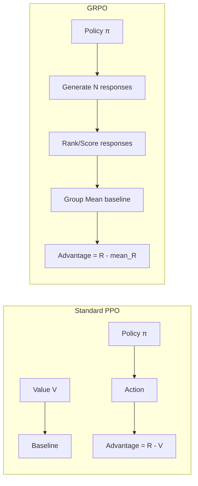

# GRPO Implementation Guide

*Technical specification for Group Relative Policy Optimization.*

---

## Overview

GRPO (Group Relative Policy Optimization) is an advanced variant of PPO designed for preference alignment, particularly effective for fine-tuning LLMs. It optimizes policies relative to group-level baselines rather than individual value estimates.

**Key Innovation**: Instead of using a learned value function, GRPO uses the mean reward within a response group as the baseline, simplifying training and improving alignment.

**Paper**: [DeepSeek-V3 Technical Report](https://arxiv.org/abs/2412.19437)

---

## Architecture



### Key Differences from PPO

| Aspect | PPO | GRPO |
|:-------|:----|:-----|
| Baseline | Learned value function V(s) | Group mean reward |
| Samples per prompt | 1 action | N responses |
| Value network | Required | Not required |
| Memory | Lower | Higher (N samples) |
| Use case | General RL | Preference alignment |

---

## Module Design

### File: `crates/pufferlib/src/training/grpo.rs`

```rust
//! Group Relative Policy Optimization.
//!
//! Implements GRPO for preference alignment.

use tch::{nn, Tensor, Kind, Device};
use crate::policy::{Policy, Distribution};

/// Configuration for GRPO training
#[derive(Clone, Debug)]
pub struct GrpoConfig {
    /// Number of responses to sample per prompt
    pub group_size: i64,
    /// PPO clip coefficient
    pub clip_coef: f64,
    /// KL penalty coefficient (β)
    pub kl_coef: f64,
    /// Entropy bonus coefficient
    pub ent_coef: f64,
    /// Whether to clip rewards
    pub clip_reward: bool,
    /// Reward clipping range
    pub reward_clip: f64,
    /// Number of optimization epochs
    pub epochs: i64,
    /// Minibatch size
    pub minibatch_size: i64,
    /// Maximum KL divergence for early stopping
    pub target_kl: Option<f64>,
}

impl Default for GrpoConfig {
    fn default() -> Self {
        Self {
            group_size: 4,
            clip_coef: 0.2,
            kl_coef: 0.1,
            ent_coef: 0.01,
            clip_reward: true,
            reward_clip: 10.0,
            epochs: 4,
            minibatch_size: 8,
            target_kl: Some(0.02),
        }
    }
}

/// A group of responses for a single prompt
#[derive(Clone)]
pub struct ResponseGroup {
    /// The input prompt/state
    pub prompt: Tensor,
    /// Generated responses [group_size, seq_len, vocab_size] or [group_size, action_dim]
    pub responses: Tensor,
    /// Log probabilities of responses under current policy
    pub log_probs: Tensor,
    /// Rewards/scores for each response
    pub rewards: Tensor,
}

impl ResponseGroup {
    /// Compute group-relative advantages
    pub fn compute_advantages(&self) -> Tensor {
        let mean_reward = self.rewards.mean(Kind::Float);
        let std_reward = self.rewards.std(true) + 1e-8;
        
        // Normalize advantages within group
        (&self.rewards - &mean_reward) / std_reward
    }
}
```

### GRPO Trainer

```rust
/// GRPO Trainer for preference alignment
pub struct GrpoTrainer<P: Policy> {
    /// Policy being trained
    policy: P,
    /// Reference policy (frozen, for KL penalty)
    ref_policy: P,
    /// Optimizer
    optimizer: nn::Optimizer,
    /// Configuration
    config: GrpoConfig,
}

impl<P: Policy + Clone> GrpoTrainer<P> {
    pub fn new(policy: P, optimizer: nn::Optimizer, config: GrpoConfig) -> Self {
        let ref_policy = policy.clone();  // Clone and freeze
        Self { policy, ref_policy, optimizer, config }
    }
    
    /// Generate a group of responses for a prompt
    pub fn generate_group(&self, prompt: &Tensor) -> ResponseGroup {
        let mut responses = Vec::with_capacity(self.config.group_size as usize);
        let mut log_probs = Vec::with_capacity(self.config.group_size as usize);
        
        for _ in 0..self.config.group_size {
            let (dist, _, _) = self.policy.forward(prompt, &None);
            let response = dist.sample();
            let log_prob = dist.log_prob(&response);
            
            responses.push(response);
            log_probs.push(log_prob);
        }
        
        ResponseGroup {
            prompt: prompt.shallow_clone(),
            responses: Tensor::stack(&responses, 0),
            log_probs: Tensor::stack(&log_probs, 0),
            rewards: Tensor::zeros(&[self.config.group_size], (Kind::Float, prompt.device())),
        }
    }
    
    /// Update policy using GRPO objective
    pub fn update(&mut self, groups: &[ResponseGroup]) -> GrpoMetrics {
        let mut total_loss = 0.0;
        let mut total_kl = 0.0;
        let mut total_entropy = 0.0;
        let mut n_updates = 0;
        
        for _ in 0..self.config.epochs {
            for group in groups {
                // Compute advantages using group mean
                let advantages = group.compute_advantages();
                
                // Forward pass under current policy
                let (dist, _, _) = self.policy.forward(&group.prompt, &None);
                let new_log_probs = dist.log_prob(&group.responses);
                let entropy = dist.entropy().mean(Kind::Float);
                
                // Forward pass under reference policy (for KL)
                let (ref_dist, _, _) = tch::no_grad(|| {
                    self.ref_policy.forward(&group.prompt, &None)
                });
                let ref_log_probs = ref_dist.log_prob(&group.responses);
                
                // GRPO policy loss with clipping
                let ratio = (new_log_probs - &group.log_probs).exp();
                let surr1 = &ratio * &advantages;
                let surr2 = ratio.clamp(
                    1.0 - self.config.clip_coef,
                    1.0 + self.config.clip_coef,
                ) * &advantages;
                let policy_loss = -surr1.min_other(&surr2).mean(Kind::Float);
                
                // KL penalty (against reference policy)
                let kl = (&ref_log_probs - &new_log_probs).mean(Kind::Float);
                let kl_loss = self.config.kl_coef * &kl;
                
                // Total loss
                let loss = &policy_loss + &kl_loss - self.config.ent_coef * &entropy;
                
                // Backward and step
                self.optimizer.zero_grad();
                loss.backward();
                self.optimizer.step();
                
                total_loss += loss.double_value(&[]);
                total_kl += kl.double_value(&[]);
                total_entropy += entropy.double_value(&[]);
                n_updates += 1;
                
                // Early stopping on KL
                if let Some(target) = self.config.target_kl {
                    if kl.double_value(&[]) > target {
                        break;
                    }
                }
            }
        }
        
        GrpoMetrics {
            loss: total_loss / n_updates as f64,
            kl: total_kl / n_updates as f64,
            entropy: total_entropy / n_updates as f64,
        }
    }
}

#[derive(Debug)]
pub struct GrpoMetrics {
    pub loss: f64,
    pub kl: f64,
    pub entropy: f64,
}
```

---

## Reward Model Integration

GRPO typically uses a reward model to score responses:

```rust
/// Reward model for scoring responses
pub trait RewardModel: Send {
    /// Score a (prompt, response) pair
    fn score(&self, prompt: &Tensor, response: &Tensor) -> Tensor;
}

/// Simple preference-based reward model
pub struct PreferenceRewardModel {
    net: nn::Sequential,
}

impl PreferenceRewardModel {
    pub fn new(vs: &nn::Path, input_dim: i64, hidden_dim: i64) -> Self {
        let net = nn::seq()
            .add(nn::linear(vs / "rm_fc1", input_dim, hidden_dim, Default::default()))
            .add_fn(|x| x.relu())
            .add(nn::linear(vs / "rm_fc2", hidden_dim, hidden_dim, Default::default()))
            .add_fn(|x| x.relu())
            .add(nn::linear(vs / "rm_fc3", hidden_dim, 1, Default::default()));
        
        Self { net }
    }
}

impl RewardModel for PreferenceRewardModel {
    fn score(&self, prompt: &Tensor, response: &Tensor) -> Tensor {
        let input = Tensor::cat(&[prompt, response], -1);
        input.apply(&self.net).squeeze_dim(-1)
    }
}

/// Training loop with reward model
pub fn grpo_training_step<P: Policy + Clone, R: RewardModel>(
    trainer: &mut GrpoTrainer<P>,
    reward_model: &R,
    prompts: &[Tensor],
) -> GrpoMetrics {
    // 1. Generate groups
    let mut groups: Vec<ResponseGroup> = prompts.iter()
        .map(|p| trainer.generate_group(p))
        .collect();
    
    // 2. Score responses with reward model
    for group in &mut groups {
        let mut rewards = Vec::with_capacity(trainer.config.group_size as usize);
        for i in 0..trainer.config.group_size {
            let response = group.responses.select(0, i);
            let reward = reward_model.score(&group.prompt, &response);
            rewards.push(reward);
        }
        group.rewards = Tensor::stack(&rewards, 0);
        
        // Optional: clip rewards
        if trainer.config.clip_reward {
            group.rewards = group.rewards.clamp(-trainer.config.reward_clip, trainer.config.reward_clip);
        }
    }
    
    // 3. Update policy
    trainer.update(&groups)
}
```

---

## Comparison: PPO vs GRPO vs DPO

```rust
/// Comparison of policy optimization objectives
mod comparison {
    use tch::Tensor;
    
    /// Standard PPO objective
    pub fn ppo_objective(
        advantages: &Tensor,     // From learned value function
        log_probs: &Tensor,
        old_log_probs: &Tensor,
        clip_coef: f64,
    ) -> Tensor {
        let ratio = (log_probs - old_log_probs).exp();
        let surr1 = &ratio * advantages;
        let surr2 = ratio.clamp(1.0 - clip_coef, 1.0 + clip_coef) * advantages;
        -surr1.min_other(&surr2).mean_dim(&[0i64][..], false, Kind::Float)
    }
    
    /// GRPO objective (no value function)
    pub fn grpo_objective(
        group_rewards: &Tensor,   // [group_size]
        log_probs: &Tensor,       // [group_size]
        old_log_probs: &Tensor,
        ref_log_probs: &Tensor,   // From frozen reference
        clip_coef: f64,
        kl_coef: f64,
    ) -> Tensor {
        // Group-relative advantages
        let mean_r = group_rewards.mean(Kind::Float);
        let std_r = group_rewards.std(true) + 1e-8;
        let advantages = (group_rewards - &mean_r) / std_r;
        
        // Clipped surrogate
        let ratio = (log_probs - old_log_probs).exp();
        let surr1 = &ratio * &advantages;
        let surr2 = ratio.clamp(1.0 - clip_coef, 1.0 + clip_coef) * &advantages;
        let policy_loss = -surr1.min_other(&surr2).mean(Kind::Float);
        
        // KL penalty
        let kl = (ref_log_probs - log_probs).mean(Kind::Float);
        
        policy_loss + kl_coef * kl
    }
    
    /// DPO objective (for comparison, different paradigm)
    pub fn dpo_objective(
        pi_logprob_chosen: &Tensor,
        pi_logprob_rejected: &Tensor,
        ref_logprob_chosen: &Tensor,
        ref_logprob_rejected: &Tensor,
        beta: f64,
    ) -> Tensor {
        let logits = beta * (
            (pi_logprob_chosen - ref_logprob_chosen) -
            (pi_logprob_rejected - ref_logprob_rejected)
        );
        -logits.sigmoid().log().mean(Kind::Float)
    }
}
```

---

## Usage Example

```rust
// Example: GRPO for a simple bandit-like scenario
fn example_grpo() {
    let vs = nn::VarStore::new(Device::Cpu);
    
    // Create policy
    let policy = MlpPolicy::new(&vs.root(), MlpConfig {
        obs_dim: 8,
        action_dim: 4,
        hidden_dim: 64,
        ..Default::default()
    });
    
    // Create reward model
    let reward_model = PreferenceRewardModel::new(&vs.root(), 8 + 4, 64);
    
    // Create trainer
    let optimizer = nn::Adam::default().build(&vs, 1e-4).unwrap();
    let config = GrpoConfig {
        group_size: 8,
        kl_coef: 0.05,
        ..Default::default()
    };
    let mut trainer = GrpoTrainer::new(policy, optimizer, config);
    
    // Training loop
    for epoch in 0..100 {
        let prompts: Vec<Tensor> = (0..32)
            .map(|_| Tensor::randn(&[8], (Kind::Float, Device::Cpu)))
            .collect();
        
        let metrics = grpo_training_step(&mut trainer, &reward_model, &prompts);
        println!("Epoch {}: loss={:.4}, kl={:.4}", epoch, metrics.loss, metrics.kl);
    }
}
```

---

## Testing

```rust
#[cfg(test)]
mod tests {
    use super::*;
    
    #[test]
    fn test_group_advantages() {
        let group = ResponseGroup {
            prompt: Tensor::zeros(&[8], (Kind::Float, Device::Cpu)),
            responses: Tensor::zeros(&[4, 5], (Kind::Float, Device::Cpu)),
            log_probs: Tensor::zeros(&[4], (Kind::Float, Device::Cpu)),
            rewards: Tensor::from_slice(&[1.0f32, 2.0, 3.0, 4.0]),
        };
        
        let adv = group.compute_advantages();
        
        // Advantages should be normalized (mean≈0, std≈1)
        assert!((adv.mean(Kind::Float).double_value(&[]) - 0.0).abs() < 1e-5);
    }
    
    #[test]
    fn test_grpo_update() {
        // Full update cycle test
    }
}
```

---

## References

- [DeepSeek-V3 Technical Report](https://arxiv.org/abs/2412.19437)
- [Fine-Tuning Language Models from Human Preferences](https://arxiv.org/abs/1909.08593)
- [Secrets of RLHF in Large Language Models](https://arxiv.org/abs/2307.04964)

---

*Last updated: 2026-01-28*
