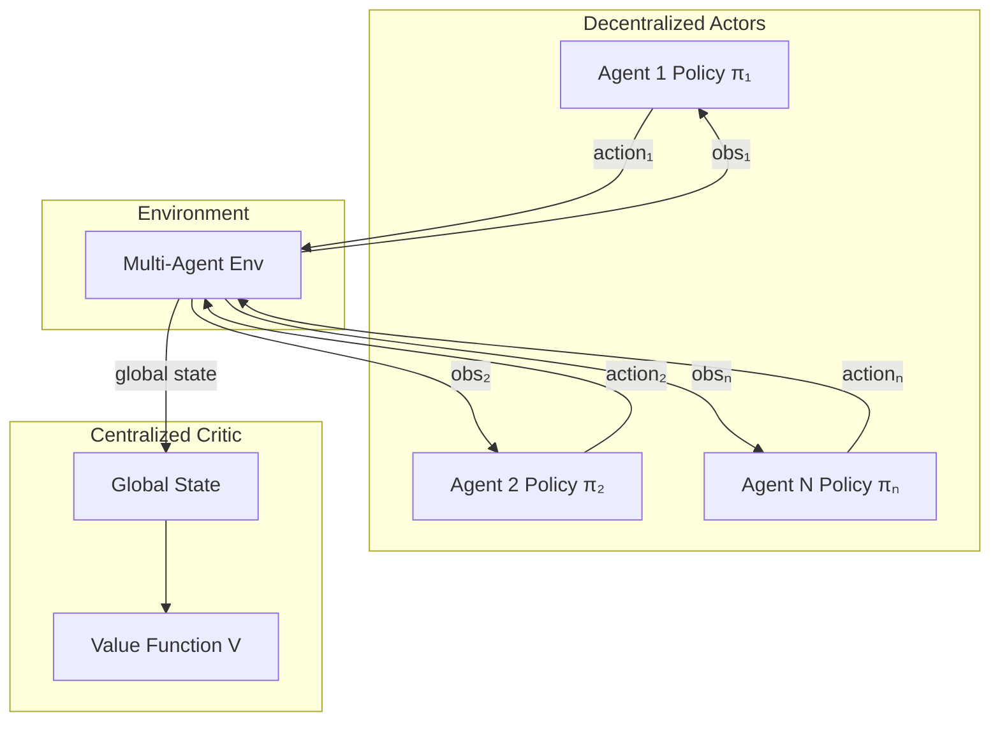

# MAPPO Implementation Guide

*Technical specification for Multi-Agent PPO in PufferLib.*

---

## Overview

Multi-Agent PPO (MAPPO) extends standard PPO to multi-agent settings using the **Centralized Training, Decentralized Execution (CTDE)** paradigm. Each agent has its own policy, but training uses a centralized critic with access to global state.

**Paper**: [The Surprising Effectiveness of PPO in Cooperative Multi-Agent Games](https://arxiv.org/abs/2103.01955)

---

## Architecture



### Key Differences from PPO

| Aspect | PPO | MAPPO |
|:-------|:----|:------|
| Policy | Single | One per agent (or shared) |
| Critic | Local observation | Global state |
| Experience | Single buffer | Per-agent buffers |
| Advantage | Standard GAE | Per-agent with global value |

---

## Module Design

### File: `crates/pufferlib/src/training/mappo.rs`

```rust
//! Multi-Agent PPO implementation.
//!
//! Supports cooperative and competitive multi-agent scenarios.

use std::collections::HashMap;
use tch::{nn, Tensor, Kind, Device};
use crate::policy::{Policy, HasVarStore, Distribution};
use crate::training::{compute_gae, ppo_policy_loss, ppo_value_loss};

/// Configuration for MAPPO
#[derive(Clone, Debug)]
pub struct MappoConfig {
    /// Number of agents
    pub num_agents: usize,
    /// Whether agents share the same policy network
    pub share_policy: bool,
    /// Whether to use global state for critic (vs concatenated obs)
    pub use_global_state: bool,
    /// Local observation dimension per agent
    pub obs_dim: i64,
    /// Global state dimension (if use_global_state)
    pub global_state_dim: i64,
    /// Action dimension per agent
    pub action_dim: i64,
    /// PPO clip coefficient
    pub clip_coef: f64,
    /// Value loss coefficient
    pub vf_coef: f64,
    /// Entropy coefficient
    pub ent_coef: f64,
    /// GAE gamma
    pub gamma: f64,
    /// GAE lambda
    pub gae_lambda: f64,
    /// Number of PPO epochs
    pub update_epochs: i64,
    /// Minibatch size
    pub minibatch_size: i64,
}

impl Default for MappoConfig {
    fn default() -> Self {
        Self {
            num_agents: 2,
            share_policy: true,
            use_global_state: true,
            obs_dim: 16,
            global_state_dim: 32,
            action_dim: 5,
            clip_coef: 0.2,
            vf_coef: 0.5,
            ent_coef: 0.01,
            gamma: 0.99,
            gae_lambda: 0.95,
            update_epochs: 10,
            minibatch_size: 256,
        }
    }
}
```

### MAPPO Trainer

```rust
/// Multi-Agent PPO Trainer
pub struct MappoTrainer<P: Policy + HasVarStore> {
    /// Agent policies (shared or individual)
    policies: Vec<P>,
    /// Centralized critic
    critic: CentralizedCritic,
    /// Policy optimizer(s)
    policy_optimizers: Vec<nn::Optimizer>,
    /// Critic optimizer
    critic_optimizer: nn::Optimizer,
    /// Configuration
    config: MappoConfig,
    /// Per-agent experience buffers
    buffers: Vec<AgentBuffer>,
}

/// Centralized critic using global state
pub struct CentralizedCritic {
    net: nn::Sequential,
    vs: nn::VarStore,
}

impl CentralizedCritic {
    pub fn new(global_state_dim: i64, hidden_dim: i64) -> Self {
        let vs = nn::VarStore::new(Device::Cpu);
        let net = nn::seq()
            .add(nn::linear(&vs.root() / "fc1", global_state_dim, hidden_dim, Default::default()))
            .add_fn(|x| x.relu())
            .add(nn::linear(&vs.root() / "fc2", hidden_dim, hidden_dim, Default::default()))
            .add_fn(|x| x.relu())
            .add(nn::linear(&vs.root() / "fc3", hidden_dim, 1, Default::default()));
        
        Self { net, vs }
    }
    
    pub fn forward(&self, global_state: &Tensor) -> Tensor {
        global_state.apply(&self.net)
    }
}

/// Per-agent experience buffer
pub struct AgentBuffer {
    observations: Vec<Tensor>,
    actions: Vec<Tensor>,
    log_probs: Vec<Tensor>,
    rewards: Vec<f32>,
    dones: Vec<bool>,
    values: Vec<Tensor>,
}

impl AgentBuffer {
    pub fn new() -> Self {
        Self {
            observations: Vec::new(),
            actions: Vec::new(),
            log_probs: Vec::new(),
            rewards: Vec::new(),
            dones: Vec::new(),
            values: Vec::new(),
        }
    }
    
    pub fn add(
        &mut self,
        obs: Tensor,
        action: Tensor,
        log_prob: Tensor,
        reward: f32,
        done: bool,
        value: Tensor,
    ) {
        self.observations.push(obs);
        self.actions.push(action);
        self.log_probs.push(log_prob);
        self.rewards.push(reward);
        self.dones.push(done);
        self.values.push(value);
    }
    
    pub fn clear(&mut self) {
        self.observations.clear();
        self.actions.clear();
        self.log_probs.clear();
        self.rewards.clear();
        self.dones.clear();
        self.values.clear();
    }
}
```

---

## Training Loop

### Rollout Collection

```rust
impl<P: Policy + HasVarStore> MappoTrainer<P> {
    /// Collect rollouts from all agents
    pub fn collect_rollout<E: MultiAgentEnv>(
        &mut self,
        env: &mut E,
        num_steps: usize,
    ) {
        let mut obs = env.reset();
        
        for _ in 0..num_steps {
            // Get global state for critic
            let global_state = env.get_global_state();
            let global_value = self.critic.forward(&global_state);
            
            // Each agent selects action
            let mut actions = Vec::with_capacity(self.config.num_agents);
            
            for (i, (agent_obs, policy)) in obs.iter().zip(&self.policies).enumerate() {
                let (dist, _, _) = policy.forward(agent_obs, &None);
                let action = dist.sample();
                let log_prob = dist.log_prob(&action);
                
                // Store in agent's buffer
                self.buffers[i].add(
                    agent_obs.shallow_clone(),
                    action.shallow_clone(),
                    log_prob.detach(),
                    0.0,  // reward filled after step
                    false,
                    global_value.shallow_clone().detach(),
                );
                
                actions.push(action);
            }
            
            // Environment step
            let step_result = env.step(&actions);
            
            // Update rewards and dones in buffers
            for (i, (reward, done)) in step_result.rewards.iter()
                .zip(&step_result.dones)
                .enumerate()
            {
                let buf = &mut self.buffers[i];
                let last_idx = buf.rewards.len() - 1;
                buf.rewards[last_idx] = *reward;
                buf.dones[last_idx] = *done;
            }
            
            obs = step_result.observations;
        }
    }
}
```

### Update Step

```rust
impl<P: Policy + HasVarStore> MappoTrainer<P> {
    /// Perform MAPPO update
    pub fn update(&mut self, global_states: &[Tensor]) -> MappoMetrics {
        let mut total_policy_loss = 0.0;
        let mut total_value_loss = 0.0;
        let mut total_entropy = 0.0;
        
        // Compute advantages for all agents using global value
        let mut all_advantages = Vec::new();
        let mut all_returns = Vec::new();
        
        for (i, buffer) in self.buffers.iter().enumerate() {
            let rewards = Tensor::from_slice(&buffer.rewards);
            let values = Tensor::stack(&buffer.values, 0);
            let dones = Tensor::from_slice(
                &buffer.dones.iter().map(|&d| if d { 1.0f32 } else { 0.0 }).collect::<Vec<_>>()
            );
            
            // Last value from critic
            let last_global_state = &global_states[global_states.len() - 1];
            let last_value = self.critic.forward(last_global_state);
            
            let advantages = compute_gae(
                &rewards.unsqueeze(1),
                &values,
                &dones.unsqueeze(1),
                &last_value,
                self.config.gamma,
                self.config.gae_lambda,
            );
            
            let returns = &advantages + &values;
            
            all_advantages.push(advantages);
            all_returns.push(returns);
        }
        
        // PPO epochs
        for _ in 0..self.config.update_epochs {
            for (i, buffer) in self.buffers.iter().enumerate() {
                let policy = if self.config.share_policy {
                    &self.policies[0]
                } else {
                    &self.policies[i]
                };
                
                // Stack buffer data
                let obs = Tensor::stack(&buffer.observations, 0);
                let actions = Tensor::stack(&buffer.actions, 0);
                let old_log_probs = Tensor::stack(&buffer.log_probs, 0);
                let advantages = &all_advantages[i];
                let returns = &all_returns[i];
                
                // Normalize advantages
                let advantages = (advantages - advantages.mean(Kind::Float)) 
                    / (advantages.std(true) + 1e-8);
                
                // Forward pass
                let (dist, _, _) = policy.forward(&obs, &None);
                let new_log_probs = dist.log_prob(&actions);
                let entropy = dist.entropy();
                
                // Policy loss
                let policy_loss = ppo_policy_loss(
                    &advantages,
                    &new_log_probs,
                    &old_log_probs,
                    self.config.clip_coef,
                );
                
                // Value loss (use global states)
                let global_obs = Tensor::stack(global_states, 0);
                let new_values = self.critic.forward(&global_obs);
                let value_loss = ppo_value_loss(
                    &new_values,
                    &Tensor::stack(&buffer.values, 0),
                    returns,
                    self.config.clip_coef,
                );
                
                // Total loss
                let loss = &policy_loss 
                    + self.config.vf_coef * &value_loss 
                    - self.config.ent_coef * entropy.mean(Kind::Float);
                
                // Backward and step
                let opt_idx = if self.config.share_policy { 0 } else { i };
                self.policy_optimizers[opt_idx].zero_grad();
                self.critic_optimizer.zero_grad();
                
                loss.backward();
                
                self.policy_optimizers[opt_idx].step();
                self.critic_optimizer.step();
                
                total_policy_loss += policy_loss.double_value(&[]);
                total_value_loss += value_loss.double_value(&[]);
                total_entropy += entropy.mean(Kind::Float).double_value(&[]);
            }
        }
        
        // Clear buffers
        for buffer in &mut self.buffers {
            buffer.clear();
        }
        
        MappoMetrics {
            policy_loss: total_policy_loss / (self.config.update_epochs as f64 * self.config.num_agents as f64),
            value_loss: total_value_loss / (self.config.update_epochs as f64 * self.config.num_agents as f64),
            entropy: total_entropy / (self.config.update_epochs as f64 * self.config.num_agents as f64),
        }
    }
}

#[derive(Debug)]
pub struct MappoMetrics {
    pub policy_loss: f64,
    pub value_loss: f64,
    pub entropy: f64,
}
```

---

## Multi-Agent Environment Trait

```rust
/// Trait for multi-agent environments
pub trait MultiAgentEnv {
    /// Number of agents
    fn num_agents(&self) -> usize;
    
    /// Reset environment, returns observations for all agents
    fn reset(&mut self) -> Vec<Tensor>;
    
    /// Step environment with actions from all agents
    fn step(&mut self, actions: &[Tensor]) -> MultiAgentStepResult;
    
    /// Get global state (concatenated obs or privileged info)
    fn get_global_state(&self) -> Tensor;
    
    /// Get agent-specific observation
    fn get_observation(&self, agent_id: usize) -> Tensor;
}

pub struct MultiAgentStepResult {
    pub observations: Vec<Tensor>,
    pub rewards: Vec<f32>,
    pub dones: Vec<bool>,
    pub info: HashMap<String, String>,
}
```

---

## Parameter Sharing

MAPPO supports both shared and independent policies:

### Shared Policy (Recommended for Cooperation)

```rust
let config = MappoConfig {
    share_policy: true,
    num_agents: 4,
    ..Default::default()
};

// Single policy, single optimizer
// Agents differentiated via agent_id embedding or local obs
```

### Independent Policies (Heterogeneous Agents)

```rust
let config = MappoConfig {
    share_policy: false,
    num_agents: 4,
    ..Default::default()
};

// One policy per agent, separate optimizers
// Better for agents with different roles
```

---

## Integration with PufferLib

### PettingZoo Example Wrapper

```rust
/// Wrapper for PettingZoo-style environments
pub struct PettingZooWrapper {
    env: Box<dyn PettingZooEnv>,
    agents: Vec<String>,
}

impl MultiAgentEnv for PettingZooWrapper {
    fn num_agents(&self) -> usize {
        self.agents.len()
    }
    
    fn reset(&mut self) -> Vec<Tensor> {
        let obs_dict = self.env.reset();
        self.agents.iter()
            .map(|a| obs_dict[a].clone())
            .collect()
    }
    
    fn step(&mut self, actions: &[Tensor]) -> MultiAgentStepResult {
        let action_dict: HashMap<_, _> = self.agents.iter()
            .zip(actions)
            .map(|(a, act)| (a.clone(), act.clone()))
            .collect();
        
        let result = self.env.step(action_dict);
        
        MultiAgentStepResult {
            observations: self.agents.iter()
                .map(|a| result.observations[a].clone())
                .collect(),
            rewards: self.agents.iter()
                .map(|a| result.rewards[a])
                .collect(),
            dones: self.agents.iter()
                .map(|a| result.dones[a])
                .collect(),
            info: HashMap::new(),
        }
    }
    
    fn get_global_state(&self) -> Tensor {
        // Concatenate all agent observations
        let obs: Vec<_> = self.agents.iter()
            .map(|a| self.env.observe(a))
            .collect();
        Tensor::cat(&obs, -1)
    }
    
    fn get_observation(&self, agent_id: usize) -> Tensor {
        self.env.observe(&self.agents[agent_id])
    }
}
```

---

## Testing Strategy

### Unit Tests

```rust
#[cfg(test)]
mod tests {
    use super::*;
    
    #[test]
    fn test_centralized_critic() {
        let critic = CentralizedCritic::new(32, 64);
        let state = Tensor::randn(&[4, 32], (Kind::Float, Device::Cpu));
        let value = critic.forward(&state);
        assert_eq!(value.size(), vec![4, 1]);
    }
    
    #[test]
    fn test_agent_buffer() {
        let mut buffer = AgentBuffer::new();
        buffer.add(
            Tensor::zeros(&[8], (Kind::Float, Device::Cpu)),
            Tensor::zeros(&[2], (Kind::Float, Device::Cpu)),
            Tensor::from(0.0f32),
            1.0,
            false,
            Tensor::from(0.5f32),
        );
        assert_eq!(buffer.observations.len(), 1);
    }
}
```

### Integration Tests

```rust
// tests/mappo_test.rs
#[test]
#[cfg(feature = "torch")]
fn test_mappo_simple_spread() {
    // Use a simple cooperative environment
    // Train for N iterations
    // Assert team reward improves
}
```

---

## Performance Tips

1. **Batch agent updates**: Process all agents in parallel when possible
2. **Share policy weights**: Reduces memory and improves sample efficiency
3. **Global state compression**: Use embedding for high-dimensional global states
4. **Gradient clipping**: Essential for multi-agent stability

---

## References

- [MAPPO Paper](https://arxiv.org/abs/2103.01955)
- [QMIX for Value Decomposition](https://arxiv.org/abs/1803.11485)
- [PettingZoo API](https://pettingzoo.farama.org/)

---

*Last updated: 2026-01-28*
