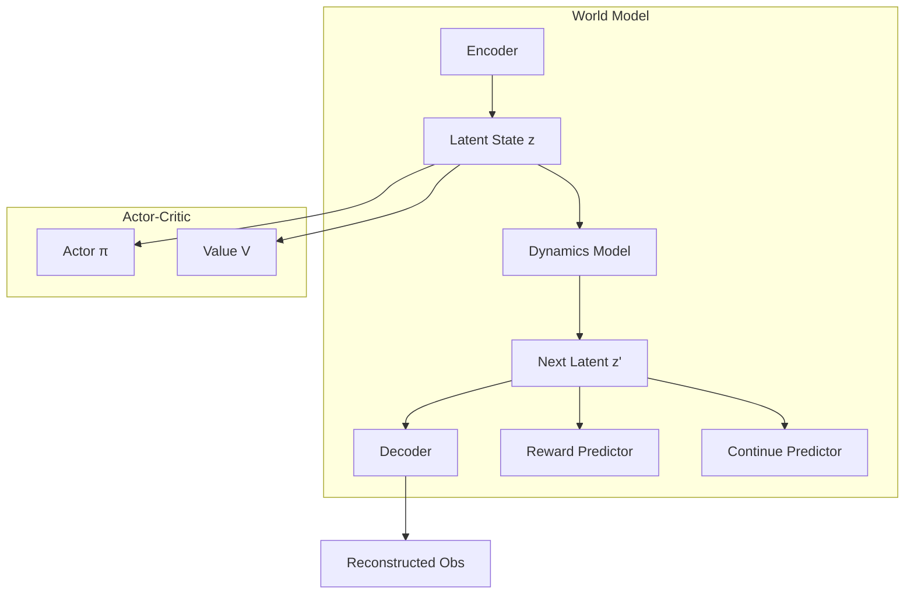

# World Models Implementation Guide

*Technical specification for model-based RL in PufferLib.*

---

## Overview

World Models learn a compressed representation of the environment dynamics, enabling **imagination-based training** where agents can learn from simulated rollouts without real environment interaction. This dramatically improves sample efficiency.

**Reference**: [DreamerV3](https://arxiv.org/abs/2301.04104)

---

## Architecture



### Components

| Component | Input | Output | Purpose |
|:----------|:------|:-------|:--------|
| Encoder | Observation | Latent z | Compress to latent space |
| Dynamics | (z, action) | z' | Predict next latent |
| Decoder | z | Obs reconstruction | Validate representation |
| Reward | z | Scalar | Predict reward |
| Continue | z | Probability | Predict episode continuation |
| Actor | z | Action dist | Policy in latent space |
| Critic | z | Value | Value in latent space |

---

## Module Design

### File: `crates/pufferlib/src/training/world.rs`

```rust
//! World Model for model-based RL.
//!
//! Implements a DreamerV3-inspired latent dynamics model.

use tch::{nn, Tensor, Kind, Device};

/// World Model configuration
#[derive(Clone, Debug)]
pub struct WorldModelConfig {
    /// Observation dimension
    pub obs_dim: i64,
    /// Action dimension
    pub action_dim: i64,
    /// Latent state dimension
    pub latent_dim: i64,
    /// Hidden layer dimension
    pub hidden_dim: i64,
    /// Number of imagination steps for training
    pub imagination_horizon: i64,
    /// Learning rate for world model
    pub world_lr: f64,
    /// Learning rate for actor-critic
    pub actor_lr: f64,
    /// Discount factor for imagination
    pub gamma: f64,
    /// Lambda for imagination returns
    pub lambda: f64,
    /// KL regularization weight
    pub kl_weight: f64,
}

impl Default for WorldModelConfig {
    fn default() -> Self {
        Self {
            obs_dim: 64,
            action_dim: 4,
            latent_dim: 32,
            hidden_dim: 256,
            imagination_horizon: 15,
            world_lr: 3e-4,
            actor_lr: 1e-4,
            gamma: 0.99,
            lambda: 0.95,
            kl_weight: 1.0,
        }
    }
}

/// Encoder: Observation -> Latent distribution
pub struct Encoder {
    net: nn::Sequential,
    mean: nn::Linear,
    logvar: nn::Linear,
}

impl Encoder {
    pub fn new(vs: &nn::Path, obs_dim: i64, hidden_dim: i64, latent_dim: i64) -> Self {
        let net = nn::seq()
            .add(nn::linear(vs / "enc_fc1", obs_dim, hidden_dim, Default::default()))
            .add_fn(|x| x.relu())
            .add(nn::linear(vs / "enc_fc2", hidden_dim, hidden_dim, Default::default()))
            .add_fn(|x| x.relu());
        
        let mean = nn::linear(vs / "enc_mean", hidden_dim, latent_dim, Default::default());
        let logvar = nn::linear(vs / "enc_logvar", hidden_dim, latent_dim, Default::default());
        
        Self { net, mean, logvar }
    }
    
    /// Encode observation to latent distribution
    pub fn forward(&self, obs: &Tensor) -> (Tensor, Tensor) {
        let h = obs.apply(&self.net);
        let mean = h.apply(&self.mean);
        let logvar = h.apply(&self.logvar);
        (mean, logvar)
    }
    
    /// Sample from latent distribution with reparameterization
    pub fn sample(&self, obs: &Tensor) -> Tensor {
        let (mean, logvar) = self.forward(obs);
        let std = (logvar * 0.5).exp();
        let eps = Tensor::randn_like(&std);
        mean + eps * std
    }
}

/// Dynamics: (Latent, Action) -> Next Latent distribution
pub struct DynamicsModel {
    net: nn::Sequential,
    mean: nn::Linear,
    logvar: nn::Linear,
}

impl DynamicsModel {
    pub fn new(vs: &nn::Path, latent_dim: i64, action_dim: i64, hidden_dim: i64) -> Self {
        let input_dim = latent_dim + action_dim;
        let net = nn::seq()
            .add(nn::linear(vs / "dyn_fc1", input_dim, hidden_dim, Default::default()))
            .add_fn(|x| x.relu())
            .add(nn::linear(vs / "dyn_fc2", hidden_dim, hidden_dim, Default::default()))
            .add_fn(|x| x.relu());
        
        let mean = nn::linear(vs / "dyn_mean", hidden_dim, latent_dim, Default::default());
        let logvar = nn::linear(vs / "dyn_logvar", hidden_dim, latent_dim, Default::default());
        
        Self { net, mean, logvar }
    }
    
    pub fn forward(&self, latent: &Tensor, action: &Tensor) -> (Tensor, Tensor) {
        let input = Tensor::cat(&[latent, action], -1);
        let h = input.apply(&self.net);
        let mean = h.apply(&self.mean);
        let logvar = h.apply(&self.logvar);
        (mean, logvar)
    }
    
    pub fn sample(&self, latent: &Tensor, action: &Tensor) -> Tensor {
        let (mean, logvar) = self.forward(latent, action);
        let std = (logvar * 0.5).exp();
        let eps = Tensor::randn_like(&std);
        mean + eps * std
    }
}

/// Reward predictor: Latent -> Reward
pub struct RewardPredictor {
    net: nn::Sequential,
}

impl RewardPredictor {
    pub fn new(vs: &nn::Path, latent_dim: i64, hidden_dim: i64) -> Self {
        let net = nn::seq()
            .add(nn::linear(vs / "rew_fc1", latent_dim, hidden_dim, Default::default()))
            .add_fn(|x| x.relu())
            .add(nn::linear(vs / "rew_fc2", hidden_dim, 1, Default::default()));
        
        Self { net }
    }
    
    pub fn forward(&self, latent: &Tensor) -> Tensor {
        latent.apply(&self.net).squeeze_dim(-1)
    }
}

/// Continue predictor: Latent -> Continue probability
pub struct ContinuePredictor {
    net: nn::Sequential,
}

impl ContinuePredictor {
    pub fn new(vs: &nn::Path, latent_dim: i64, hidden_dim: i64) -> Self {
        let net = nn::seq()
            .add(nn::linear(vs / "cont_fc1", latent_dim, hidden_dim, Default::default()))
            .add_fn(|x| x.relu())
            .add(nn::linear(vs / "cont_fc2", hidden_dim, 1, Default::default()))
            .add_fn(|x| x.sigmoid());
        
        Self { net }
    }
    
    pub fn forward(&self, latent: &Tensor) -> Tensor {
        latent.apply(&self.net).squeeze_dim(-1)
    }
}

/// Complete World Model
pub struct WorldModel {
    pub config: WorldModelConfig,
    pub encoder: Encoder,
    pub dynamics: DynamicsModel,
    pub reward_pred: RewardPredictor,
    pub continue_pred: ContinuePredictor,
    pub vs: nn::VarStore,
}

impl WorldModel {
    pub fn new(config: WorldModelConfig) -> Self {
        let vs = nn::VarStore::new(Device::Cpu);
        let encoder = Encoder::new(&vs.root(), config.obs_dim, config.hidden_dim, config.latent_dim);
        let dynamics = DynamicsModel::new(&vs.root(), config.latent_dim, config.action_dim, config.hidden_dim);
        let reward_pred = RewardPredictor::new(&vs.root(), config.latent_dim, config.hidden_dim);
        let continue_pred = ContinuePredictor::new(&vs.root(), config.latent_dim, config.hidden_dim);
        
        Self { config, encoder, dynamics, reward_pred, continue_pred, vs }
    }
}
```

---

## Imagination Rollouts

```rust
/// Imagination-based actor-critic in latent space
pub struct ImaginationActor {
    actor: nn::Sequential,
    critic: nn::Sequential,
}

impl ImaginationActor {
    pub fn new(vs: &nn::Path, latent_dim: i64, action_dim: i64, hidden_dim: i64) -> Self {
        let actor = nn::seq()
            .add(nn::linear(vs / "actor_fc1", latent_dim, hidden_dim, Default::default()))
            .add_fn(|x| x.relu())
            .add(nn::linear(vs / "actor_fc2", hidden_dim, action_dim, Default::default()));
        
        let critic = nn::seq()
            .add(nn::linear(vs / "critic_fc1", latent_dim, hidden_dim, Default::default()))
            .add_fn(|x| x.relu())
            .add(nn::linear(vs / "critic_fc2", hidden_dim, 1, Default::default()));
        
        Self { actor, critic }
    }
    
    pub fn get_action(&self, latent: &Tensor) -> (Tensor, Tensor) {
        let logits = latent.apply(&self.actor);
        let value = latent.apply(&self.critic);
        (logits, value)
    }
}

/// Perform imagination rollouts for actor training
pub fn imagine_ahead(
    world: &WorldModel,
    actor: &ImaginationActor,
    initial_latent: &Tensor,
    horizon: i64,
) -> ImaginationTrajectory {
    let batch_size = initial_latent.size()[0];
    let mut latents = vec![initial_latent.shallow_clone()];
    let mut actions = Vec::new();
    let mut rewards = Vec::new();
    let mut continues = Vec::new();
    let mut values = Vec::new();
    
    let mut latent = initial_latent.shallow_clone();
    
    for _ in 0..horizon {
        // Get action from actor
        let (action_logits, value) = actor.get_action(&latent);
        let action = action_logits.softmax(-1, Kind::Float);  // or sample
        
        // Imagine next state
        let next_latent = world.dynamics.sample(&latent, &action);
        let reward = world.reward_pred.forward(&next_latent);
        let cont = world.continue_pred.forward(&next_latent);
        
        actions.push(action);
        rewards.push(reward);
        continues.push(cont);
        values.push(value);
        latents.push(next_latent.shallow_clone());
        
        latent = next_latent;
    }
    
    ImaginationTrajectory { latents, actions, rewards, continues, values }
}

pub struct ImaginationTrajectory {
    pub latents: Vec<Tensor>,
    pub actions: Vec<Tensor>,
    pub rewards: Vec<Tensor>,
    pub continues: Vec<Tensor>,
    pub values: Vec<Tensor>,
}

/// Compute lambda returns for imagination trajectory
pub fn compute_imagination_returns(
    traj: &ImaginationTrajectory,
    gamma: f64,
    lambda: f64,
) -> Tensor {
    let horizon = traj.rewards.len();
    let mut returns = vec![Tensor::zeros_like(&traj.rewards[0]); horizon];
    
    // Bootstrap from last value
    let mut next_return = traj.values.last().unwrap().shallow_clone();
    
    for t in (0..horizon).rev() {
        let reward = &traj.rewards[t];
        let cont = &traj.continues[t];
        let value = &traj.values[t];
        
        // TD target
        let td_target = reward + gamma * cont * &next_return;
        
        // Lambda return
        returns[t] = (1.0 - lambda) * value + lambda * &td_target;
        next_return = returns[t].shallow_clone();
    }
    
    Tensor::stack(&returns, 0)
}
```

---

## Training Loop

### World Model Training

```rust
pub fn train_world_model(
    world: &mut WorldModel,
    optimizer: &mut nn::Optimizer,
    batch: &ExperienceBatch,
) -> WorldModelLoss {
    // Encode observations
    let (post_mean, post_logvar) = world.encoder.forward(&batch.observations);
    let latent = sample_gaussian(&post_mean, &post_logvar);
    
    // Dynamics prediction
    let (prior_mean, prior_logvar) = world.dynamics.forward(&latent, &batch.actions);
    
    // Next state encoding (target)
    let (next_post_mean, next_post_logvar) = world.encoder.forward(&batch.next_observations);
    
    // Losses
    // 1. KL divergence between prior and posterior
    let kl_loss = gaussian_kl(&prior_mean, &prior_logvar, &next_post_mean, &next_post_logvar);
    
    // 2. Reward prediction
    let pred_reward = world.reward_pred.forward(&latent);
    let reward_loss = (&pred_reward - &batch.rewards).pow_tensor_scalar(2).mean(Kind::Float);
    
    // 3. Continue prediction
    let pred_continue = world.continue_pred.forward(&latent);
    let continue_loss = binary_cross_entropy(&pred_continue, &batch.continues);
    
    // Total loss
    let loss = world.config.kl_weight * &kl_loss + &reward_loss + &continue_loss;
    
    optimizer.zero_grad();
    loss.backward();
    optimizer.step();
    
    WorldModelLoss {
        kl: kl_loss.double_value(&[]),
        reward: reward_loss.double_value(&[]),
        continue_: continue_loss.double_value(&[]),
    }
}

fn gaussian_kl(m1: &Tensor, lv1: &Tensor, m2: &Tensor, lv2: &Tensor) -> Tensor {
    let var1 = lv1.exp();
    let var2 = lv2.exp();
    (lv2 - lv1 + (var1 + (m1 - m2).pow_tensor_scalar(2)) / var2 - 1.0).sum(Kind::Float) * 0.5
}
```

### Actor-Critic Training

```rust
pub fn train_actor_critic(
    world: &WorldModel,
    actor: &mut ImaginationActor,
    optimizer: &mut nn::Optimizer,
    initial_latents: &Tensor,
    config: &WorldModelConfig,
) -> ActorLoss {
    // Imagination rollouts
    let traj = imagine_ahead(world, actor, initial_latents, config.imagination_horizon);
    
    // Compute lambda returns
    let returns = compute_imagination_returns(&traj, config.gamma, config.lambda);
    
    // Actor loss: maximize expected return
    let values = Tensor::stack(&traj.values, 0);
    let advantages = &returns - &values;
    
    // Policy gradient (simplified)
    let actor_loss = -advantages.mean(Kind::Float);
    
    // Value loss
    let value_loss = (&values - &returns.detach()).pow_tensor_scalar(2).mean(Kind::Float);
    
    let loss = &actor_loss + 0.5 * &value_loss;
    
    optimizer.zero_grad();
    loss.backward();
    optimizer.step();
    
    ActorLoss {
        actor: actor_loss.double_value(&[]),
        value: value_loss.double_value(&[]),
    }
}
```

---

## Integration with Trainer

```rust
/// World Model Trainer combining all components
pub struct WorldTrainer {
    world: WorldModel,
    actor: ImaginationActor,
    world_optimizer: nn::Optimizer,
    actor_optimizer: nn::Optimizer,
    replay_buffer: ReplayBuffer,
    config: WorldModelConfig,
}

impl WorldTrainer {
    pub fn train_step(&mut self, real_batch: &ExperienceBatch) -> TrainMetrics {
        // 1. Add to replay buffer
        self.replay_buffer.add(real_batch);
        
        // 2. Sample from buffer
        let batch = self.replay_buffer.sample(256);
        
        // 3. Train world model
        let world_loss = train_world_model(&mut self.world, &mut self.world_optimizer, &batch);
        
        // 4. Encode initial states for imagination
        let initial_latents = self.world.encoder.sample(&batch.observations);
        
        // 5. Train actor in imagination
        let actor_loss = train_actor_critic(
            &self.world,
            &mut self.actor,
            &mut self.actor_optimizer,
            &initial_latents,
            &self.config,
        );
        
        TrainMetrics { world_loss, actor_loss }
    }
}
```

---

## Testing Strategy

```rust
#[cfg(test)]
mod tests {
    use super::*;
    
    #[test]
    fn test_encoder_roundtrip() {
        // Encode -> sample -> check shape
    }
    
    #[test]
    fn test_dynamics_prediction() {
        // Predict next latent -> check shape
    }
    
    #[test]
    fn test_imagination_rollout() {
        // Run imagination -> check trajectory length
    }
    
    #[test]
    fn test_lambda_returns() {
        // Compute returns -> check values make sense
    }
}
```

---

## References

- [DreamerV3](https://arxiv.org/abs/2301.04104)
- [World Models (Ha & Schmidhuber)](https://arxiv.org/abs/1803.10122)
- [PlaNet](https://arxiv.org/abs/1811.04551)

---

*Last updated: 2026-01-28*
