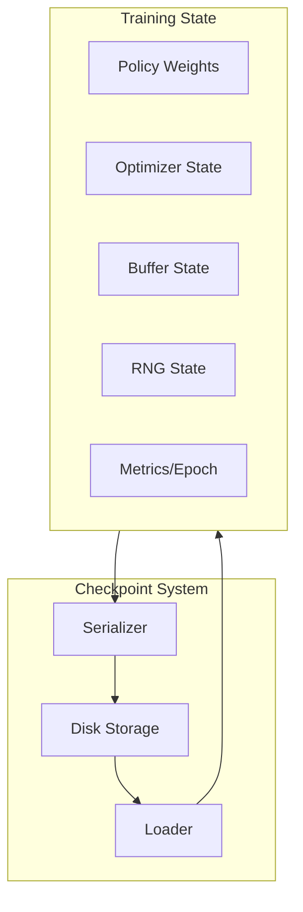

# Checkpointing System Design

*Technical specification for fault-tolerant training with checkpoint/resume.*

---

## Overview

The checkpointing system enables robust training that can recover from failures. It serializes the complete training state (policy weights, optimizer state, experience buffer, RNG state) to disk and can resume from any checkpoint.

---

## Architecture



---

## Module Design

### File: `crates/pufferlib/src/checkpoint/mod.rs`

```rust
//! Checkpointing system for fault-tolerant training.

mod state;
mod resume;

pub use state::{CheckpointState, Checkpointable};
pub use resume::{CheckpointManager, CheckpointConfig};
```

### Checkpointable Trait

```rust
// File: crates/pufferlib/src/checkpoint/state.rs

use serde::{Serialize, Deserialize};
use std::path::Path;
use crate::Result;

/// Trait for components that can be checkpointed
pub trait Checkpointable {
    /// Serialize state to bytes
    fn save_state(&self) -> Result<Vec<u8>>;
    
    /// Restore state from bytes
    fn load_state(&mut self, data: &[u8]) -> Result<()>;
}

/// Complete training checkpoint
#[derive(Serialize, Deserialize)]
pub struct CheckpointState {
    /// Training epoch number
    pub epoch: u64,
    /// Global step count
    pub global_step: u64,
    /// Policy weights (serialized VarStore)
    pub policy_weights: Vec<u8>,
    /// Optimizer state
    pub optimizer_state: Vec<u8>,
    /// Experience buffer state
    pub buffer_state: Option<Vec<u8>>,
    /// RNG state for reproducibility
    pub rng_state: [u8; 32],
    /// Training metrics snapshot
    pub metrics: CheckpointMetrics,
    /// Configuration hash (to detect config changes)
    pub config_hash: String,
    /// Timestamp
    pub timestamp: String,
    /// PufferLib version
    pub version: String,
}

#[derive(Serialize, Deserialize, Clone, Debug)]
pub struct CheckpointMetrics {
    pub mean_reward: f64,
    pub mean_episode_length: f64,
    pub policy_loss: f64,
    pub value_loss: f64,
    pub entropy: f64,
}
```

### Trainer Checkpointing

```rust
#[cfg(feature = "torch")]
impl<P: Policy + HasVarStore, V: VecEnvBackend> Checkpointable for Trainer<P, V> {
    fn save_state(&self) -> Result<Vec<u8>> {
        // Serialize VarStore to bytes
        let mut policy_bytes = Vec::new();
        self.policy.var_store().save_to_stream(&mut policy_bytes)?;
        
        // Serialize optimizer (note: tch-rs has limited optimizer serialization)
        // For now, we save learning rate and momentum state
        let optimizer_state = self.serialize_optimizer()?;
        
        // Serialize buffer if needed
        let buffer_state = if self.config.checkpoint_buffer {
            Some(self.buffer.save_state()?)
        } else {
            None
        };
        
        // Get RNG state
        let rng_state = rand::thread_rng().gen::<[u8; 32]>();
        
        let state = CheckpointState {
            epoch: self.epoch,
            global_step: self.global_step,
            policy_weights: policy_bytes,
            optimizer_state,
            buffer_state,
            rng_state,
            metrics: CheckpointMetrics {
                mean_reward: self.mean_reward,
                mean_episode_length: self.mean_episode_length,
                policy_loss: self.last_policy_loss,
                value_loss: self.last_value_loss,
                entropy: self.last_entropy,
            },
            config_hash: self.config.hash(),
            timestamp: chrono::Utc::now().to_rfc3339(),
            version: crate::VERSION.to_string(),
        };
        
        Ok(bincode::serialize(&state)?)
    }
    
    fn load_state(&mut self, data: &[u8]) -> Result<()> {
        let state: CheckpointState = bincode::deserialize(data)?;
        
        // Validate config compatibility
        if state.config_hash != self.config.hash() {
            log::warn!("Checkpoint config differs from current config");
        }
        
        // Restore policy weights
        let mut cursor = std::io::Cursor::new(&state.policy_weights);
        self.policy.var_store_mut().load_from_stream(cursor)?;
        
        // Restore optimizer (limited support)
        self.deserialize_optimizer(&state.optimizer_state)?;
        
        // Restore buffer if present
        if let Some(buffer_data) = &state.buffer_state {
            self.buffer.load_state(buffer_data)?;
        }
        
        // Restore training state
        self.epoch = state.epoch;
        self.global_step = state.global_step;
        self.mean_reward = state.metrics.mean_reward;
        
        Ok(())
    }
}
```

---

## Checkpoint Manager

```rust
// File: crates/pufferlib/src/checkpoint/resume.rs

use std::path::{Path, PathBuf};
use std::fs;

/// Configuration for checkpoint management
#[derive(Clone, Debug)]
pub struct CheckpointConfig {
    /// Directory to store checkpoints
    pub checkpoint_dir: PathBuf,
    /// Save checkpoint every N epochs
    pub save_every: u64,
    /// Keep only the last N checkpoints
    pub keep_last: usize,
    /// Also save a "best" checkpoint based on reward
    pub save_best: bool,
    /// Whether to save buffer state (can be large)
    pub save_buffer: bool,
    /// Compression level (0 = none, 9 = max)
    pub compression: u8,
}

impl Default for CheckpointConfig {
    fn default() -> Self {
        Self {
            checkpoint_dir: PathBuf::from("checkpoints"),
            save_every: 10,
            keep_last: 5,
            save_best: true,
            save_buffer: false,
            compression: 6,
        }
    }
}

/// Manages checkpoint lifecycle
pub struct CheckpointManager {
    config: CheckpointConfig,
    best_reward: f64,
}

impl CheckpointManager {
    pub fn new(config: CheckpointConfig) -> Self {
        // Create checkpoint directory
        fs::create_dir_all(&config.checkpoint_dir).ok();
        
        Self {
            config,
            best_reward: f64::NEG_INFINITY,
        }
    }
    
    /// Save a checkpoint if conditions are met
    pub fn maybe_save<T: Checkpointable>(
        &mut self,
        trainable: &T,
        epoch: u64,
        reward: f64,
    ) -> Result<Option<PathBuf>> {
        if epoch % self.config.save_every != 0 {
            return Ok(None);
        }
        
        let data = trainable.save_state()?;
        let filename = format!("checkpoint_epoch_{:06}.bin", epoch);
        let path = self.config.checkpoint_dir.join(&filename);
        
        // Write with optional compression
        if self.config.compression > 0 {
            let compressed = zstd::encode_all(&data[..], self.config.compression as i32)?;
            fs::write(&path, compressed)?;
        } else {
            fs::write(&path, data)?;
        }
        
        log::info!("Saved checkpoint: {}", path.display());
        
        // Save best checkpoint
        if self.config.save_best && reward > self.best_reward {
            self.best_reward = reward;
            let best_path = self.config.checkpoint_dir.join("checkpoint_best.bin");
            fs::copy(&path, &best_path)?;
            log::info!("New best checkpoint! Reward: {:.2}", reward);
        }
        
        // Cleanup old checkpoints
        self.cleanup_old_checkpoints()?;
        
        Ok(Some(path))
    }
    
    /// Load the latest checkpoint
    pub fn load_latest<T: Checkpointable>(&self, trainable: &mut T) -> Result<Option<u64>> {
        let latest = self.find_latest_checkpoint()?;
        
        if let Some(path) = latest {
            let data = fs::read(&path)?;
            let decompressed = if self.config.compression > 0 {
                zstd::decode_all(&data[..])?
            } else {
                data
            };
            
            trainable.load_state(&decompressed)?;
            
            // Extract epoch from filename
            let filename = path.file_stem().unwrap().to_str().unwrap();
            let epoch: u64 = filename
                .strip_prefix("checkpoint_epoch_")
                .and_then(|s| s.parse().ok())
                .unwrap_or(0);
            
            log::info!("Loaded checkpoint from epoch {}", epoch);
            Ok(Some(epoch))
        } else {
            Ok(None)
        }
    }
    
    /// Load the best checkpoint
    pub fn load_best<T: Checkpointable>(&self, trainable: &mut T) -> Result<bool> {
        let best_path = self.config.checkpoint_dir.join("checkpoint_best.bin");
        
        if best_path.exists() {
            let data = fs::read(&best_path)?;
            let decompressed = if self.config.compression > 0 {
                zstd::decode_all(&data[..])?
            } else {
                data
            };
            
            trainable.load_state(&decompressed)?;
            log::info!("Loaded best checkpoint");
            Ok(true)
        } else {
            Ok(false)
        }
    }
    
    fn find_latest_checkpoint(&self) -> Result<Option<PathBuf>> {
        let mut checkpoints: Vec<PathBuf> = fs::read_dir(&self.config.checkpoint_dir)?
            .filter_map(|e| e.ok())
            .map(|e| e.path())
            .filter(|p| {
                p.file_name()
                    .and_then(|n| n.to_str())
                    .map(|n| n.starts_with("checkpoint_epoch_"))
                    .unwrap_or(false)
            })
            .collect();
        
        checkpoints.sort();
        Ok(checkpoints.pop())
    }
    
    fn cleanup_old_checkpoints(&self) -> Result<()> {
        let mut checkpoints: Vec<PathBuf> = fs::read_dir(&self.config.checkpoint_dir)?
            .filter_map(|e| e.ok())
            .map(|e| e.path())
            .filter(|p| {
                p.file_name()
                    .and_then(|n| n.to_str())
                    .map(|n| n.starts_with("checkpoint_epoch_"))
                    .unwrap_or(false)
            })
            .collect();
        
        checkpoints.sort();
        
        while checkpoints.len() > self.config.keep_last {
            let old = checkpoints.remove(0);
            fs::remove_file(&old)?;
            log::debug!("Removed old checkpoint: {}", old.display());
        }
        
        Ok(())
    }
}
```

---

## Usage Example

```rust
use pufferlib::training::{Trainer, TrainerConfig};
use pufferlib::checkpoint::{CheckpointManager, CheckpointConfig};

fn main() -> Result<()> {
    // Create trainer
    let mut trainer = Trainer::new(policy, env, config);
    
    // Setup checkpointing
    let ckpt_config = CheckpointConfig {
        checkpoint_dir: PathBuf::from("./runs/exp1/checkpoints"),
        save_every: 100,
        keep_last: 3,
        save_best: true,
        ..Default::default()
    };
    let mut ckpt_manager = CheckpointManager::new(ckpt_config);
    
    // Try to resume from checkpoint
    if let Some(epoch) = ckpt_manager.load_latest(&mut trainer)? {
        println!("Resumed from epoch {}", epoch);
    }
    
    // Training loop
    for epoch in trainer.epoch..1000 {
        let metrics = trainer.train_epoch();
        
        // Save checkpoint
        ckpt_manager.maybe_save(&trainer, epoch, metrics.mean_reward)?;
    }
    
    Ok(())
}
```

---

## CLI Integration

```bash
# Start training with checkpointing
pufferlib-cli train --env CartPole --checkpoint-dir ./checkpoints --save-every 100

# Resume from latest checkpoint
pufferlib-cli train --env CartPole --resume ./checkpoints

# Resume from specific checkpoint
pufferlib-cli train --env CartPole --resume ./checkpoints/checkpoint_epoch_000500.bin

# Resume from best checkpoint
pufferlib-cli train --env CartPole --resume-best ./checkpoints
```

---

## Checkpoint Format

```
checkpoints/
├── checkpoint_epoch_000100.bin
├── checkpoint_epoch_000200.bin
├── checkpoint_epoch_000300.bin  (latest)
├── checkpoint_best.bin          (symlink or copy)
└── metadata.json                (optional: run info)
```

### Metadata JSON (optional)

```json
{
  "experiment_name": "cartpole_ppo_v1",
  "started_at": "2026-01-28T10:00:00Z",
  "config": {
    "learning_rate": 0.0003,
    "num_envs": 16,
    "...": "..."
  },
  "checkpoints": [
    {"epoch": 100, "reward": 45.2, "path": "checkpoint_epoch_000100.bin"},
    {"epoch": 200, "reward": 120.5, "path": "checkpoint_epoch_000200.bin"},
    {"epoch": 300, "reward": 195.0, "path": "checkpoint_epoch_000300.bin"}
  ]
}
```

---

## Testing

```rust
#[cfg(test)]
mod tests {
    use super::*;
    use tempfile::tempdir;
    
    #[test]
    fn test_checkpoint_save_load() {
        let dir = tempdir().unwrap();
        let config = CheckpointConfig {
            checkpoint_dir: dir.path().to_path_buf(),
            save_every: 1,
            ..Default::default()
        };
        
        // Create trainer, save checkpoint
        let mut trainer = create_test_trainer();
        trainer.train_epoch();
        
        let mut manager = CheckpointManager::new(config);
        manager.maybe_save(&trainer, 1, 100.0).unwrap();
        
        // Create new trainer, load checkpoint
        let mut trainer2 = create_test_trainer();
        manager.load_latest(&mut trainer2).unwrap();
        
        assert_eq!(trainer.epoch, trainer2.epoch);
    }
    
    #[test]
    fn test_checkpoint_cleanup() {
        // Test that old checkpoints are removed
    }
    
    #[test]
    fn test_best_checkpoint() {
        // Test best checkpoint tracking
    }
}
```

---

## Dependencies

```toml
[dependencies]
bincode = "1.3"
zstd = { version = "0.12", optional = true }
chrono = "0.4"

[features]
checkpoint = ["bincode"]
checkpoint-compressed = ["checkpoint", "zstd"]
```

---

*Last updated: 2026-01-28*
