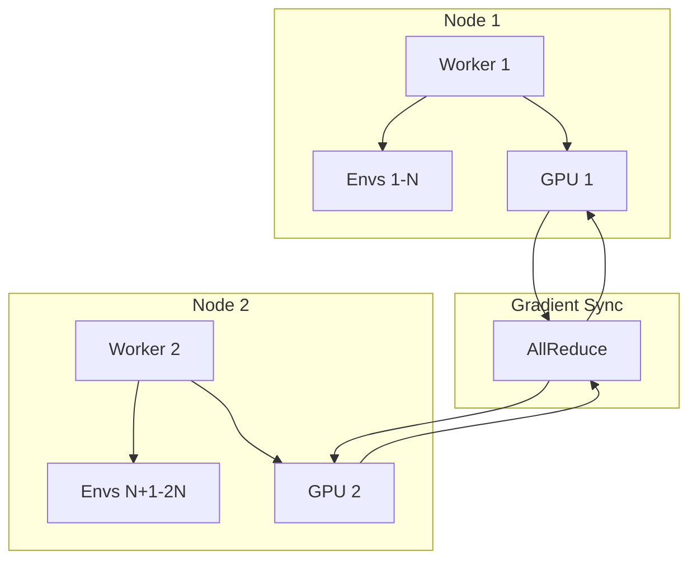

# Distributed Training Guide

*Technical specification for multi-GPU and multi-node training.*

---

## Overview

Distributed training enables scaling to larger batch sizes and faster training by parallelizing across multiple GPUs or nodes. PufferLib supports:

1. **Data Parallelism**: Same model, different data batches
2. **Environment Parallelism**: Distributed rollout collection
3. **Gradient Synchronization**: AllReduce for distributed SGD

---

## Architecture



---

## Module Design

### File: `crates/pufferlib/src/training/distributed.rs`

```rust
//! Distributed training utilities.

use std::sync::Arc;

/// Distributed training configuration
#[derive(Clone, Debug)]
pub struct DistributedConfig {
    /// Total number of workers
    pub world_size: usize,
    /// This worker's rank (0-indexed)
    pub rank: usize,
    /// Master node address
    pub master_addr: String,
    /// Master node port
    pub master_port: u16,
    /// Backend: "nccl" for GPU, "gloo" for CPU
    pub backend: String,
    /// Whether to use gradient accumulation
    pub gradient_accumulation_steps: usize,
}

impl Default for DistributedConfig {
    fn default() -> Self {
        Self {
            world_size: 1,
            rank: 0,
            master_addr: "localhost".to_string(),
            master_port: 29500,
            backend: "nccl".to_string(),
            gradient_accumulation_steps: 1,
        }
    }
}

/// Trait for distributed communication
pub trait DistributedBackend: Send + Sync {
    /// Initialize the distributed environment
    fn init(&mut self) -> Result<(), DistributedError>;
    
    /// AllReduce operation (sum gradients)
    fn all_reduce(&self, tensor: &mut tch::Tensor);
    
    /// Broadcast from rank 0
    fn broadcast(&self, tensor: &mut tch::Tensor);
    
    /// Barrier synchronization
    fn barrier(&self);
    
    /// Get world size
    fn world_size(&self) -> usize;
    
    /// Get current rank
    fn rank(&self) -> usize;
    
    /// Check if this is the master process
    fn is_master(&self) -> bool {
        self.rank() == 0
    }
    
    /// Cleanup
    fn finalize(&mut self);
}

#[derive(Debug)]
pub enum DistributedError {
    InitFailed(String),
    CommunicationError(String),
}
```

### NCCL Backend (GPU)

```rust
#[cfg(feature = "nccl")]
pub struct NcclBackend {
    config: DistributedConfig,
    initialized: bool,
}

#[cfg(feature = "nccl")]
impl NcclBackend {
    pub fn new(config: DistributedConfig) -> Self {
        Self { config, initialized: false }
    }
}

#[cfg(feature = "nccl")]
impl DistributedBackend for NcclBackend {
    fn init(&mut self) -> Result<(), DistributedError> {
        // Initialize via tch-rs distributed
        std::env::set_var("MASTER_ADDR", &self.config.master_addr);
        std::env::set_var("MASTER_PORT", self.config.master_port.to_string());
        std::env::set_var("WORLD_SIZE", self.config.world_size.to_string());
        std::env::set_var("RANK", self.config.rank.to_string());
        
        tch::distributed::init_process_group(&self.config.backend)
            .map_err(|e| DistributedError::InitFailed(e.to_string()))?;
        
        self.initialized = true;
        Ok(())
    }
    
    fn all_reduce(&self, tensor: &mut tch::Tensor) {
        tch::distributed::all_reduce(tensor, tch::distributed::ReduceOp::Sum);
        *tensor /= self.config.world_size as f64;
    }
    
    fn broadcast(&self, tensor: &mut tch::Tensor) {
        tch::distributed::broadcast(tensor, 0);
    }
    
    fn barrier(&self) {
        tch::distributed::barrier();
    }
    
    fn world_size(&self) -> usize {
        self.config.world_size
    }
    
    fn rank(&self) -> usize {
        self.config.rank
    }
    
    fn finalize(&mut self) {
        if self.initialized {
            tch::distributed::destroy_process_group();
            self.initialized = false;
        }
    }
}
```

---

## Distributed Trainer

```rust
/// Distributed PPO trainer
pub struct DistributedTrainer<P: Policy + HasVarStore, V: VecEnvBackend, D: DistributedBackend> {
    /// Local trainer
    trainer: Trainer<P, V>,
    /// Distributed backend
    dist: D,
    /// Gradient accumulation counter
    accumulation_step: usize,
    /// Configuration
    config: DistributedConfig,
}

impl<P: Policy + HasVarStore, V: VecEnvBackend, D: DistributedBackend> DistributedTrainer<P, V, D> {
    pub fn new(
        trainer: Trainer<P, V>,
        mut dist: D,
        config: DistributedConfig,
    ) -> Result<Self, DistributedError> {
        dist.init()?;
        
        // Broadcast initial weights from rank 0
        if dist.world_size() > 1 {
            for (_, mut tensor) in trainer.policy.var_store().variables() {
                dist.broadcast(&mut tensor);
            }
        }
        
        Ok(Self {
            trainer,
            dist,
            accumulation_step: 0,
            config,
        })
    }
    
    /// Distributed training step
    pub fn train_step(&mut self) -> Option<TrainMetrics> {
        // Collect rollout locally
        self.trainer.collect_rollout();
        
        // Compute gradients (but don't apply yet)
        let gradients = self.trainer.compute_gradients();
        
        self.accumulation_step += 1;
        
        // Only sync and apply after accumulation steps
        if self.accumulation_step >= self.config.gradient_accumulation_steps {
            // AllReduce gradients across workers
            for grad in gradients.iter_mut() {
                self.dist.all_reduce(grad);
            }
            
            // Apply gradients
            self.trainer.apply_gradients(&gradients);
            
            // Reset accumulation
            self.accumulation_step = 0;
            
            // Barrier to sync workers
            self.dist.barrier();
            
            // Return metrics (only from master for logging)
            if self.dist.is_master() {
                return Some(self.trainer.get_metrics());
            }
        }
        
        None
    }
    
    /// Synchronize model weights (e.g., after loading checkpoint)
    pub fn sync_weights(&mut self) {
        for (_, mut tensor) in self.trainer.policy.var_store_mut().variables() {
            self.dist.broadcast(&mut tensor);
        }
        self.dist.barrier();
    }
}
```

---

## Launch Script

```python
# launch_distributed.py
import subprocess
import sys

def launch(num_workers: int, script: str, args: list):
    """Launch distributed training across multiple processes."""
    processes = []
    
    for rank in range(num_workers):
        env = {
            "RANK": str(rank),
            "WORLD_SIZE": str(num_workers),
            "MASTER_ADDR": "localhost",
            "MASTER_PORT": "29500",
        }
        
        cmd = [sys.executable, script] + args
        proc = subprocess.Popen(cmd, env={**os.environ, **env})
        processes.append(proc)
    
    for proc in processes:
        proc.wait()

if __name__ == "__main__":
    launch(4, "train.py", ["--env", "CartPole"])
```

---

## CLI Integration

```bash
# Single GPU
pufferlib-cli train --env CartPole

# Multi-GPU (same node)
pufferlib-cli train --env CartPole --distributed --world-size 4

# Multi-node
# Node 0:
pufferlib-cli train --env CartPole --distributed --world-size 8 --rank 0 --master-addr node0

# Node 1:
pufferlib-cli train --env CartPole --distributed --world-size 8 --rank 4 --master-addr node0
```

---

## Performance Considerations

1. **Batch Size Scaling**: Effective batch = local_batch × world_size × accumulation_steps
2. **Learning Rate Scaling**: Linear scaling rule: lr = base_lr × world_size
3. **Warmup**: Use learning rate warmup for large batch training
4. **Gradient Compression**: Consider gradient compression for bandwidth-limited networks

---

## Testing

```rust
#[cfg(test)]
mod tests {
    use super::*;
    
    #[test]
    fn test_distributed_config() {
        let config = DistributedConfig::default();
        assert_eq!(config.world_size, 1);
        assert_eq!(config.rank, 0);
    }
    
    // Integration tests require multiple processes
    // Run with: cargo test --features distributed -- --test-threads=1
}
```

---

*Last updated: 2026-01-28*
