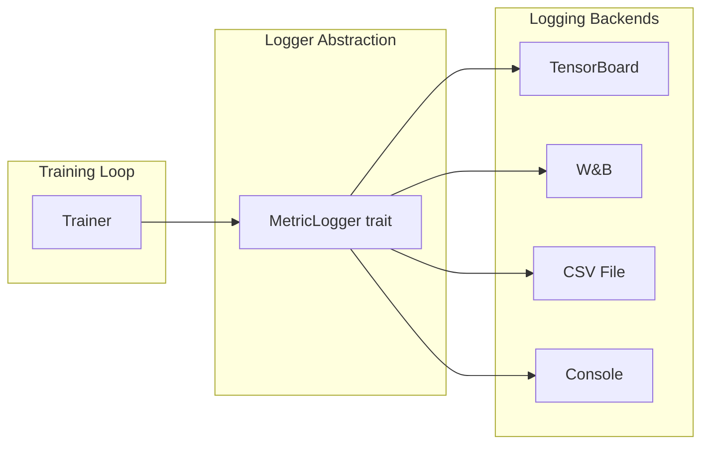

# Logging & Observability Guide

*Technical specification for TensorBoard and W&B integration.*

---

## Overview

The logging system provides observability into training through:
- **Scalar metrics**: Loss, reward, learning rate
- **Histograms**: Weight distributions, gradient norms
- **Images**: Observation samples, attention maps
- **Hyperparameters**: Experiment configuration

---

## Architecture



---

## Module Design

### File: `crates/pufferlib/src/logging/mod.rs`

```rust
//! Logging and metrics system.

mod tensorboard;
mod wandb;
mod console;

pub use tensorboard::TensorBoardLogger;
pub use wandb::WandbLogger;
pub use console::ConsoleLogger;

use std::collections::HashMap;

/// Trait for metric logging backends
pub trait MetricLogger: Send {
    /// Log a scalar value
    fn log_scalar(&mut self, tag: &str, value: f64, step: u64);
    
    /// Log multiple scalars at once
    fn log_scalars(&mut self, tag: &str, values: HashMap<String, f64>, step: u64);
    
    /// Log a histogram
    fn log_histogram(&mut self, tag: &str, values: &[f64], step: u64);
    
    /// Log an image
    fn log_image(&mut self, tag: &str, image: &[u8], width: u32, height: u32, step: u64);
    
    /// Log hyperparameters (called once at start)
    fn log_hyperparameters(&mut self, hparams: HashMap<String, HparamValue>);
    
    /// Flush pending writes
    fn flush(&mut self);
    
    /// Close the logger
    fn close(&mut self);
}

/// Hyperparameter value types
#[derive(Clone, Debug)]
pub enum HparamValue {
    Float(f64),
    Int(i64),
    String(String),
    Bool(bool),
}

/// Composite logger that writes to multiple backends
pub struct MultiLogger {
    loggers: Vec<Box<dyn MetricLogger>>,
}

impl MultiLogger {
    pub fn new() -> Self {
        Self { loggers: Vec::new() }
    }
    
    pub fn add<L: MetricLogger + 'static>(&mut self, logger: L) {
        self.loggers.push(Box::new(logger));
    }
}

impl MetricLogger for MultiLogger {
    fn log_scalar(&mut self, tag: &str, value: f64, step: u64) {
        for logger in &mut self.loggers {
            logger.log_scalar(tag, value, step);
        }
    }
    
    fn log_scalars(&mut self, tag: &str, values: HashMap<String, f64>, step: u64) {
        for logger in &mut self.loggers {
            logger.log_scalars(tag, values.clone(), step);
        }
    }
    
    fn log_histogram(&mut self, tag: &str, values: &[f64], step: u64) {
        for logger in &mut self.loggers {
            logger.log_histogram(tag, values, step);
        }
    }
    
    fn log_image(&mut self, tag: &str, image: &[u8], width: u32, height: u32, step: u64) {
        for logger in &mut self.loggers {
            logger.log_image(tag, image, width, height, step);
        }
    }
    
    fn log_hyperparameters(&mut self, hparams: HashMap<String, HparamValue>) {
        for logger in &mut self.loggers {
            logger.log_hyperparameters(hparams.clone());
        }
    }
    
    fn flush(&mut self) {
        for logger in &mut self.loggers {
            logger.flush();
        }
    }
    
    fn close(&mut self) {
        for logger in &mut self.loggers {
            logger.close();
        }
    }
}
```

---

## TensorBoard Integration

### File: `crates/pufferlib/src/logging/tensorboard.rs`

```rust
//! TensorBoard logging backend.

use super::{MetricLogger, HparamValue};
use std::collections::HashMap;
use std::path::PathBuf;
use tensorboard_rs::summary_writer::SummaryWriter;

/// TensorBoard logger
pub struct TensorBoardLogger {
    writer: SummaryWriter,
    log_dir: PathBuf,
}

impl TensorBoardLogger {
    /// Create a new TensorBoard logger
    pub fn new(log_dir: impl Into<PathBuf>) -> Self {
        let log_dir = log_dir.into();
        std::fs::create_dir_all(&log_dir).ok();
        
        let writer = SummaryWriter::new(&log_dir.to_string_lossy());
        
        Self { writer, log_dir }
    }
    
    /// Get the log directory path
    pub fn log_dir(&self) -> &PathBuf {
        &self.log_dir
    }
}

impl MetricLogger for TensorBoardLogger {
    fn log_scalar(&mut self, tag: &str, value: f64, step: u64) {
        self.writer.add_scalar(tag, value as f32, step as usize);
    }
    
    fn log_scalars(&mut self, tag: &str, values: HashMap<String, f64>, step: u64) {
        for (name, value) in values {
            let full_tag = format!("{}/{}", tag, name);
            self.writer.add_scalar(&full_tag, value as f32, step as usize);
        }
    }
    
    fn log_histogram(&mut self, tag: &str, values: &[f64], step: u64) {
        let float_values: Vec<f32> = values.iter().map(|&v| v as f32).collect();
        self.writer.add_histogram(tag, &float_values, step as usize);
    }
    
    fn log_image(&mut self, tag: &str, image: &[u8], width: u32, height: u32, step: u64) {
        // Convert to TensorBoard image format
        self.writer.add_image(tag, image, height as usize, width as usize, step as usize);
    }
    
    fn log_hyperparameters(&mut self, hparams: HashMap<String, HparamValue>) {
        // TensorBoard hparams plugin
        let hparams_str: HashMap<String, String> = hparams.iter()
            .map(|(k, v)| (k.clone(), format!("{:?}", v)))
            .collect();
        
        // Log as text summary
        let hparams_text = serde_json::to_string_pretty(&hparams_str).unwrap_or_default();
        self.writer.add_text("hyperparameters", &hparams_text, 0);
    }
    
    fn flush(&mut self) {
        self.writer.flush();
    }
    
    fn close(&mut self) {
        self.writer.flush();
    }
}
```

---

## Weights & Biases Integration

### File: `crates/pufferlib/src/logging/wandb.rs`

```rust
//! Weights & Biases logging backend.

use super::{MetricLogger, HparamValue};
use std::collections::HashMap;
use std::process::Command;

/// Weights & Biases logger
pub struct WandbLogger {
    project: String,
    run_name: String,
    run_id: Option<String>,
    initialized: bool,
}

impl WandbLogger {
    /// Create a new W&B logger
    pub fn new(project: &str, run_name: Option<&str>) -> Self {
        Self {
            project: project.to_string(),
            run_name: run_name.unwrap_or("run").to_string(),
            run_id: None,
            initialized: false,
        }
    }
    
    /// Initialize W&B run (call once before logging)
    pub fn init(&mut self, config: HashMap<String, HparamValue>) -> Result<(), WandbError> {
        // Use wandb CLI or Python subprocess
        // This is a simplified implementation
        
        let config_json = serde_json::to_string(&config)?;
        
        let output = Command::new("python")
            .args([
                "-c",
                &format!(
                    r#"
import wandb
import json
config = json.loads('{}')
run = wandb.init(project='{}', name='{}', config=config)
print(run.id)
"#,
                    config_json, self.project, self.run_name
                ),
            ])
            .output()?;
        
        if output.status.success() {
            self.run_id = Some(String::from_utf8_lossy(&output.stdout).trim().to_string());
            self.initialized = true;
            Ok(())
        } else {
            Err(WandbError::InitFailed(
                String::from_utf8_lossy(&output.stderr).to_string()
            ))
        }
    }
    
    fn log_dict(&self, data: HashMap<String, f64>, step: u64) {
        if !self.initialized {
            return;
        }
        
        let data_json = serde_json::to_string(&data).unwrap_or_default();
        
        Command::new("python")
            .args([
                "-c",
                &format!(
                    r#"
import wandb
import json
data = json.loads('{}')
wandb.log(data, step={})
"#,
                    data_json, step
                ),
            ])
            .spawn()
            .ok();
    }
}

impl MetricLogger for WandbLogger {
    fn log_scalar(&mut self, tag: &str, value: f64, step: u64) {
        let mut data = HashMap::new();
        data.insert(tag.to_string(), value);
        self.log_dict(data, step);
    }
    
    fn log_scalars(&mut self, tag: &str, values: HashMap<String, f64>, step: u64) {
        let prefixed: HashMap<String, f64> = values.into_iter()
            .map(|(k, v)| (format!("{}/{}", tag, k), v))
            .collect();
        self.log_dict(prefixed, step);
    }
    
    fn log_histogram(&mut self, tag: &str, values: &[f64], step: u64) {
        // W&B histograms via Python
        if !self.initialized {
            return;
        }
        
        let values_json = serde_json::to_string(values).unwrap_or_default();
        
        Command::new("python")
            .args([
                "-c",
                &format!(
                    r#"
import wandb
import json
values = json.loads('{}')
wandb.log({{"{}": wandb.Histogram(values)}}, step={})
"#,
                    values_json, tag, step
                ),
            ])
            .spawn()
            .ok();
    }
    
    fn log_image(&mut self, tag: &str, image: &[u8], width: u32, height: u32, step: u64) {
        // Save image to temp file and log via W&B
        // Implementation depends on image format
    }
    
    fn log_hyperparameters(&mut self, hparams: HashMap<String, HparamValue>) {
        // Hparams are logged at init time
        if !self.initialized {
            self.init(hparams).ok();
        }
    }
    
    fn flush(&mut self) {
        // W&B auto-flushes
    }
    
    fn close(&mut self) {
        if self.initialized {
            Command::new("python")
                .args(["-c", "import wandb; wandb.finish()"])
                .spawn()
                .ok();
        }
    }
}

#[derive(Debug)]
pub enum WandbError {
    InitFailed(String),
    JsonError(serde_json::Error),
    IoError(std::io::Error),
}

impl From<serde_json::Error> for WandbError {
    fn from(e: serde_json::Error) -> Self {
        WandbError::JsonError(e)
    }
}

impl From<std::io::Error> for WandbError {
    fn from(e: std::io::Error) -> Self {
        WandbError::IoError(e)
    }
}
```

---

## Console Logger

### File: `crates/pufferlib/src/logging/console.rs`

```rust
//! Console logging backend for debugging.

use super::{MetricLogger, HparamValue};
use std::collections::HashMap;

/// Simple console logger
pub struct ConsoleLogger {
    prefix: String,
    log_every: u64,
    last_step: u64,
}

impl ConsoleLogger {
    pub fn new(prefix: &str, log_every: u64) -> Self {
        Self {
            prefix: prefix.to_string(),
            log_every,
            last_step: 0,
        }
    }
}

impl MetricLogger for ConsoleLogger {
    fn log_scalar(&mut self, tag: &str, value: f64, step: u64) {
        if step % self.log_every == 0 && step != self.last_step {
            println!("[{}] Step {}: {} = {:.4}", self.prefix, step, tag, value);
            self.last_step = step;
        }
    }
    
    fn log_scalars(&mut self, tag: &str, values: HashMap<String, f64>, step: u64) {
        if step % self.log_every == 0 && step != self.last_step {
            let formatted: Vec<String> = values.iter()
                .map(|(k, v)| format!("{}={:.4}", k, v))
                .collect();
            println!("[{}] Step {}: {} {{ {} }}", 
                self.prefix, step, tag, formatted.join(", "));
            self.last_step = step;
        }
    }
    
    fn log_histogram(&mut self, _tag: &str, _values: &[f64], _step: u64) {
        // Skip histograms in console
    }
    
    fn log_image(&mut self, _tag: &str, _image: &[u8], _width: u32, _height: u32, _step: u64) {
        // Skip images in console
    }
    
    fn log_hyperparameters(&mut self, hparams: HashMap<String, HparamValue>) {
        println!("[{}] Hyperparameters:", self.prefix);
        for (k, v) in hparams {
            println!("  {}: {:?}", k, v);
        }
    }
    
    fn flush(&mut self) {}
    fn close(&mut self) {}
}
```

---

## Trainer Integration

```rust
use crate::logging::{MetricLogger, MultiLogger, TensorBoardLogger, ConsoleLogger};

impl<P: Policy + HasVarStore, V: VecEnvBackend> Trainer<P, V> {
    /// Set up logging
    pub fn with_logger<L: MetricLogger + 'static>(mut self, logger: L) -> Self {
        self.logger = Some(Box::new(logger));
        self
    }
    
    /// Log training metrics
    fn log_metrics(&mut self, metrics: &TrainMetrics) {
        if let Some(logger) = &mut self.logger {
            let step = self.global_step;
            
            // Scalars
            logger.log_scalar("train/reward", metrics.mean_reward, step);
            logger.log_scalar("train/episode_length", metrics.mean_episode_length, step);
            logger.log_scalar("train/policy_loss", metrics.policy_loss, step);
            logger.log_scalar("train/value_loss", metrics.value_loss, step);
            logger.log_scalar("train/entropy", metrics.entropy, step);
            logger.log_scalar("train/learning_rate", self.current_lr(), step);
            
            // Grouped scalars
            let mut losses = HashMap::new();
            losses.insert("policy".to_string(), metrics.policy_loss);
            losses.insert("value".to_string(), metrics.value_loss);
            losses.insert("entropy".to_string(), -metrics.entropy);
            logger.log_scalars("losses", losses, step);
            
            // Histograms (weights)
            if step % 1000 == 0 {
                for (name, tensor) in self.policy.var_store().variables() {
                    let values: Vec<f64> = Vec::<f32>::try_from(tensor.flatten(0, -1))
                        .unwrap()
                        .into_iter()
                        .map(|v| v as f64)
                        .collect();
                    logger.log_histogram(&format!("weights/{}", name), &values, step);
                }
            }
        }
    }
}
```

---

## Usage Examples

### Basic TensorBoard

```rust
let logger = TensorBoardLogger::new("./runs/exp1");

let trainer = Trainer::new(policy, env, config)
    .with_logger(logger);

// Training...

// View with: tensorboard --logdir ./runs
```

### Multi-Backend Logging

```rust
let mut multi_logger = MultiLogger::new();
multi_logger.add(TensorBoardLogger::new("./runs/exp1"));
multi_logger.add(ConsoleLogger::new("TRAIN", 100));

let mut wandb = WandbLogger::new("pufferlib-experiments", Some("cartpole-ppo"));
wandb.init(hparams.clone()).ok();
multi_logger.add(wandb);

let trainer = Trainer::new(policy, env, config)
    .with_logger(multi_logger);
```

---

## CLI Integration

```bash
# TensorBoard logging
pufferlib-cli train --env CartPole --log-dir ./runs/exp1

# W&B logging
pufferlib-cli train --env CartPole --wandb --wandb-project myproject

# Both
pufferlib-cli train --env CartPole --log-dir ./runs/exp1 --wandb
```

---

## Dependencies

```toml
[dependencies]
tensorboard-rs = { version = "0.6", optional = true }
serde_json = "1.0"

[features]
tensorboard = ["tensorboard-rs"]
wandb = []  # Uses Python subprocess
```

---

*Last updated: 2026-01-28*
