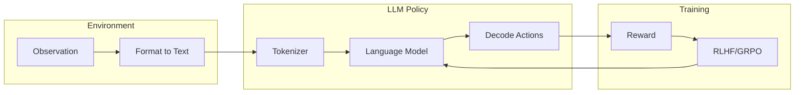

# LLM Policy Integration Guide

*Technical specification for using Large Language Models as policy backbones.*

---

## Overview

LLM policies leverage the reasoning capabilities of language models for RL tasks. This is particularly useful for:
- **Text-based environments**: Interactive fiction, dialogue systems
- **Reasoning tasks**: Mathematical problem solving, code generation
- **Generalization**: Transfer learning across similar tasks

---

## Architecture



---

## LLM Policy Wrapper

### File: `crates/pufferlib/src/policy/llm.rs`

```rust
//! LLM-based policy wrappers.

use std::collections::HashMap;

/// Configuration for LLM policy
#[derive(Clone, Debug)]
pub struct LLMPolicyConfig {
    /// Model name or path
    pub model: String,
    /// Maximum input tokens
    pub max_input_tokens: usize,
    /// Maximum output tokens
    pub max_output_tokens: usize,
    /// Temperature for sampling
    pub temperature: f64,
    /// Top-p sampling
    pub top_p: f64,
    /// Whether to use local model vs API
    pub use_local: bool,
    /// API endpoint (if not local)
    pub api_endpoint: Option<String>,
}

impl Default for LLMPolicyConfig {
    fn default() -> Self {
        Self {
            model: "gpt-4".into(),
            max_input_tokens: 4096,
            max_output_tokens: 256,
            temperature: 0.7,
            top_p: 0.9,
            use_local: false,
            api_endpoint: None,
        }
    }
}

/// Trait for converting observations to text prompts
pub trait ObservationFormatter: Send {
    /// Format observation as text for LLM input
    fn format(&self, observation: &[f32], info: &HashMap<String, String>) -> String;
    
    /// System prompt describing the task
    fn system_prompt(&self) -> String;
}

/// Trait for parsing LLM output to actions
pub trait ActionParser: Send {
    /// Parse LLM text output to action tensor
    fn parse(&self, text: &str) -> Option<Vec<f32>>;
    
    /// Get action format description for prompting
    fn action_format(&self) -> String;
}

/// Simple discrete action parser (expects "Action: N")
pub struct DiscreteActionParser {
    num_actions: usize,
}

impl DiscreteActionParser {
    pub fn new(num_actions: usize) -> Self {
        Self { num_actions }
    }
}

impl ActionParser for DiscreteActionParser {
    fn parse(&self, text: &str) -> Option<Vec<f32>> {
        // Look for "Action: N" pattern
        for line in text.lines() {
            if let Some(rest) = line.strip_prefix("Action:") {
                if let Ok(action) = rest.trim().parse::<usize>() {
                    if action < self.num_actions {
                        return Some(vec![action as f32]);
                    }
                }
            }
        }
        None
    }
    
    fn action_format(&self) -> String {
        format!(
            "Respond with 'Action: N' where N is a number from 0 to {}",
            self.num_actions - 1
        )
    }
}

/// CartPole observation formatter
pub struct CartPoleFormatter;

impl ObservationFormatter for CartPoleFormatter {
    fn format(&self, observation: &[f32], _info: &HashMap<String, String>) -> String {
        format!(
            "Cart Position: {:.3}
Cart Velocity: {:.3}
Pole Angle: {:.3} radians
Pole Angular Velocity: {:.3}

The cart can move left (0) or right (1).
Keep the pole balanced (angle close to 0) while keeping the cart near center.",
            observation[0], observation[1], observation[2], observation[3]
        )
    }
    
    fn system_prompt(&self) -> String {
        "You are controlling a cart-pole system. Your goal is to keep the pole balanced.".into()
    }
}
```

---

## API-Based LLM Policy

```rust
/// LLM policy using external API
pub struct APILLMPolicy<F: ObservationFormatter, P: ActionParser> {
    config: LLMPolicyConfig,
    formatter: F,
    parser: P,
    client: reqwest::blocking::Client,
}

impl<F: ObservationFormatter, P: ActionParser> APILLMPolicy<F, P> {
    pub fn new(config: LLMPolicyConfig, formatter: F, parser: P) -> Self {
        Self {
            config,
            formatter,
            parser,
            client: reqwest::blocking::Client::new(),
        }
    }
    
    /// Query the LLM API
    fn query(&self, prompt: &str) -> Result<String, LLMError> {
        let endpoint = self.config.api_endpoint.as_ref()
            .unwrap_or(&"https://api.openai.com/v1/chat/completions".to_string());
        
        let body = serde_json::json!({
            "model": self.config.model,
            "messages": [
                {"role": "system", "content": self.formatter.system_prompt()},
                {"role": "user", "content": format!("{}\n\n{}", prompt, self.parser.action_format())}
            ],
            "temperature": self.config.temperature,
            "max_tokens": self.config.max_output_tokens,
        });
        
        let response = self.client
            .post(endpoint)
            .header("Authorization", format!("Bearer {}", std::env::var("OPENAI_API_KEY").unwrap_or_default()))
            .json(&body)
            .send()
            .map_err(|e| LLMError::NetworkError(e.to_string()))?;
        
        let json: serde_json::Value = response.json()
            .map_err(|e| LLMError::ParseError(e.to_string()))?;
        
        json["choices"][0]["message"]["content"]
            .as_str()
            .map(|s| s.to_string())
            .ok_or(LLMError::ParseError("Missing content".into()))
    }
    
    /// Get action from observation
    pub fn get_action(&self, observation: &[f32], info: &HashMap<String, String>) -> Result<Vec<f32>, LLMError> {
        let prompt = self.formatter.format(observation, info);
        let response = self.query(&prompt)?;
        
        self.parser.parse(&response)
            .ok_or(LLMError::ActionParseError(response))
    }
}

#[derive(Debug)]
pub enum LLMError {
    NetworkError(String),
    ParseError(String),
    ActionParseError(String),
}
```

---

## Local LLM Policy (with Candle)

```rust
#[cfg(feature = "candle")]
/// Local LLM policy using Candle
pub struct LocalLLMPolicy<F: ObservationFormatter, P: ActionParser> {
    model: candle_transformers::models::llama::Llama,
    tokenizer: tokenizers::Tokenizer,
    formatter: F,
    parser: P,
    config: LLMPolicyConfig,
}

#[cfg(feature = "candle")]
impl<F: ObservationFormatter, P: ActionParser> LocalLLMPolicy<F, P> {
    pub fn load(model_path: &str, formatter: F, parser: P, config: LLMPolicyConfig) -> Result<Self, LLMError> {
        // Load model weights
        let device = candle_core::Device::Cpu;
        let vb = candle_nn::VarBuilder::from_pth(model_path, candle_core::DType::F32, &device)
            .map_err(|e| LLMError::ParseError(e.to_string()))?;
        
        // Load tokenizer
        let tokenizer = tokenizers::Tokenizer::from_file(format!("{}/tokenizer.json", model_path))
            .map_err(|e| LLMError::ParseError(e.to_string()))?;
        
        // Initialize model (simplified)
        let model = todo!("Initialize Llama model from vb");
        
        Ok(Self { model, tokenizer, formatter, parser, config })
    }
    
    /// Generate text from prompt
    fn generate(&self, prompt: &str) -> Result<String, LLMError> {
        // Tokenize
        let tokens = self.tokenizer.encode(prompt, false)
            .map_err(|e| LLMError::ParseError(e.to_string()))?;
        
        // Generate (simplified autoregressive loop)
        let mut output_tokens = tokens.get_ids().to_vec();
        
        for _ in 0..self.config.max_output_tokens {
            let input = candle_core::Tensor::from_slice(
                &output_tokens,
                (1, output_tokens.len()),
                &candle_core::Device::Cpu,
            ).unwrap();
            
            // Forward pass
            let logits = todo!("model.forward(&input)");
            
            // Sample next token
            let next_token = todo!("sample from logits");
            
            output_tokens.push(next_token);
            
            // Check for EOS
            if next_token == self.tokenizer.token_to_id("</s>").unwrap_or(0) {
                break;
            }
        }
        
        // Decode
        self.tokenizer.decode(&output_tokens, true)
            .map_err(|e| LLMError::ParseError(e.to_string()))
    }
    
    pub fn get_action(&self, observation: &[f32], info: &HashMap<String, String>) -> Result<Vec<f32>, LLMError> {
        let prompt = format!(
            "{}\n\n{}\n\n{}",
            self.formatter.system_prompt(),
            self.formatter.format(observation, info),
            self.parser.action_format()
        );
        
        let response = self.generate(&prompt)?;
        
        self.parser.parse(&response)
            .ok_or(LLMError::ActionParseError(response))
    }
}
```

---

## Training LLM Policies

### RLHF Integration

```rust
/// RLHF trainer for LLM policies
pub struct RLHFTrainer {
    /// Reward model
    reward_model: RewardModel,
    /// Reference policy (frozen)
    ref_policy: LLMPolicyConfig,
    /// KL coefficient
    kl_coef: f64,
}

impl RLHFTrainer {
    /// Compute RLHF loss
    pub fn compute_loss(
        &self,
        responses: &[String],
        prompts: &[String],
        policy_log_probs: &Tensor,
        ref_log_probs: &Tensor,
    ) -> Tensor {
        // Get rewards from reward model
        let rewards: Vec<f64> = responses.iter().zip(prompts)
            .map(|(r, p)| self.reward_model.score(p, r))
            .collect();
        let rewards = Tensor::from_slice(&rewards);
        
        // KL penalty
        let kl = (policy_log_probs - ref_log_probs).mean(Kind::Float);
        
        // RLHF objective: maximize reward - KL penalty
        let loss = -(&rewards - self.kl_coef * &kl).mean(Kind::Float);
        
        loss
    }
}

/// Reward model for scoring responses
pub trait RewardModel: Send {
    fn score(&self, prompt: &str, response: &str) -> f64;
}

/// Preference-based reward model
pub struct PreferenceRewardModel {
    // Trained on human preference data
    model: nn::Sequential,
}

impl RewardModel for PreferenceRewardModel {
    fn score(&self, _prompt: &str, _response: &str) -> f64 {
        // Encode and score
        todo!()
    }
}
```

---

## Example: Text Game Environment

```rust
/// Text-based adventure game environment
pub struct TextGameEnv {
    state: String,
    inventory: Vec<String>,
    location: String,
}

impl TextGameEnv {
    pub fn new() -> Self {
        Self {
            state: "You are in a dark forest. There is a path to the north.".into(),
            inventory: vec![],
            location: "forest".into(),
        }
    }
}

/// Formatter for text game
pub struct TextGameFormatter;

impl ObservationFormatter for TextGameFormatter {
    fn format(&self, _observation: &[f32], info: &HashMap<String, String>) -> String {
        let state = info.get("state").cloned().unwrap_or_default();
        let inventory = info.get("inventory").cloned().unwrap_or_default();
        
        format!(
            "Current situation:\n{}\n\nInventory: {}",
            state,
            if inventory.is_empty() { "Empty" } else { &inventory }
        )
    }
    
    fn system_prompt(&self) -> String {
        "You are playing a text adventure game. Make decisions to progress through the story.".into()
    }
}

/// Parser for text game actions
pub struct TextGameParser;

impl ActionParser for TextGameParser {
    fn parse(&self, text: &str) -> Option<Vec<f32>> {
        // Map common actions to discrete values
        let text_lower = text.to_lowercase();
        
        let action = if text_lower.contains("go north") || text_lower.contains("north") {
            0.0
        } else if text_lower.contains("go south") || text_lower.contains("south") {
            1.0
        } else if text_lower.contains("take") || text_lower.contains("pick up") {
            2.0
        } else if text_lower.contains("use") {
            3.0
        } else if text_lower.contains("look") || text_lower.contains("examine") {
            4.0
        } else {
            return None;
        };
        
        Some(vec![action])
    }
    
    fn action_format(&self) -> String {
        "Choose an action: go north, go south, take [item], use [item], or look around.".into()
    }
}
```

---

## Usage Example

```rust
fn llm_cartpole() {
    // Setup
    let config = LLMPolicyConfig {
        model: "gpt-4-turbo".into(),
        temperature: 0.3,
        ..Default::default()
    };
    
    let formatter = CartPoleFormatter;
    let parser = DiscreteActionParser::new(2);
    
    let policy = APILLMPolicy::new(config, formatter, parser);
    
    // Create environment
    let mut env = CartPole::new();
    let (obs, _) = env.reset(Some(42));
    
    // Run episode
    let mut total_reward = 0.0;
    let obs_slice = obs.as_slice().unwrap();
    
    loop {
        let action = policy.get_action(obs_slice, &HashMap::new())
            .unwrap_or(vec![0.0]);
        
        let result = env.step(&ndarray::ArrayD::from_shape_vec(
            ndarray::IxDyn(&[1]),
            action.clone(),
        ).unwrap());
        
        total_reward += result.reward;
        
        if result.terminated || result.truncated {
            break;
        }
    }
    
    println!("Episode reward: {}", total_reward);
}
```

---

## Performance Considerations

1. **Latency**: API calls are slow; batch requests when possible
2. **Cost**: Token-based pricing; minimize prompt length
3. **Caching**: Cache responses for similar observations
4. **Local vs API**: Use local models for training, API for evaluation
5. **Quantization**: 4-bit quantization for local models

---

## Testing

```rust
#[cfg(test)]
mod tests {
    use super::*;
    
    #[test]
    fn test_discrete_parser() {
        let parser = DiscreteActionParser::new(4);
        
        assert_eq!(parser.parse("Action: 0"), Some(vec![0.0]));
        assert_eq!(parser.parse("I think Action: 2 is best"), Some(vec![2.0]));
        assert_eq!(parser.parse("Action: 5"), None);  // Out of range
        assert_eq!(parser.parse("No action here"), None);
    }
    
    #[test]
    fn test_cartpole_formatter() {
        let formatter = CartPoleFormatter;
        let obs = vec![0.0f32, 0.1, -0.05, 0.2];
        let text = formatter.format(&obs, &HashMap::new());
        
        assert!(text.contains("Cart Position"));
        assert!(text.contains("Pole Angle"));
    }
}
```

---

## References

- [RLHF (InstructGPT)](https://arxiv.org/abs/2203.02155)
- [LLM Agents Survey](https://arxiv.org/abs/2309.07864)
- [Candle LLM Models](https://github.com/huggingface/candle)

---

*Last updated: 2026-01-28*
